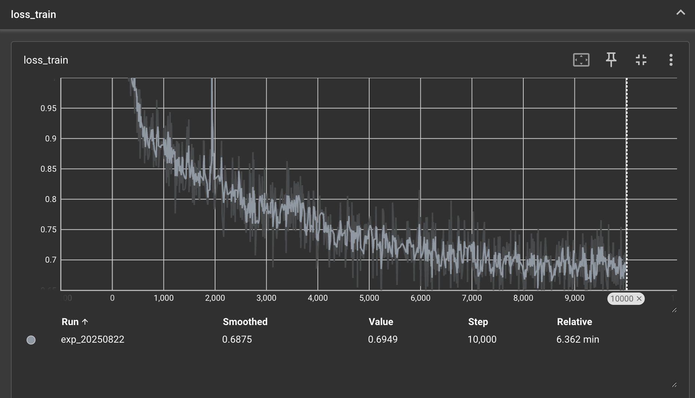
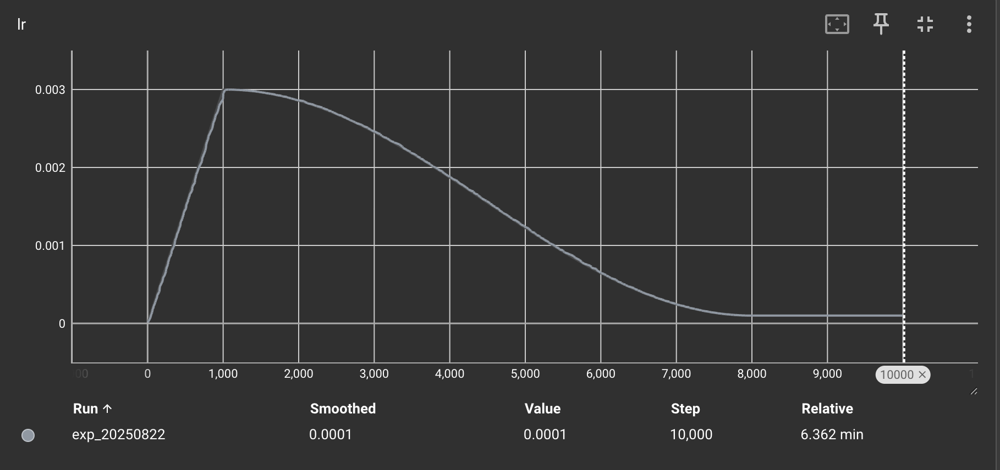

[中文](./README_cn.md)

# LLM from Scratch

This repository contains a from-scratch implementation of a modern decoder-only Transformer model in PyTorch, built for educational purposes. It includes all the essential building blocks of a modern language model, written in a clear, modular, and understandable way. The goal of this project is to provide a comprehensive resource for learning how large language models are built from the ground up.

## Features

* **From-Scratch Implementation:** Every component of the Transformer model is implemented from scratch using PyTorch, providing a deep understanding of the underlying mechanisms.
* **Modern Architecture:** The model incorporates modern techniques used in state-of-the-art language models, including:
  * **RMSNorm:** for efficient and stable layer normalization.
  * **SwiGLU:** activation function in the feed-forward network for improved performance.
  * **Rotary Position Embeddings (RoPE):** for effective positional encoding.
* **Distributed Training:** Supports Distributed Data Parallel (DDP) for training on multiple GPUs.
* **Custom BPE Tokenizer:** A from-scratch implementation of the Byte Pair Encoding (BPE) tokenizer, which can be trained on any text corpus.
* **Custom Optimizers:** Includes custom implementations of `AdamW` and `SGDDecay` optimizers.
* **Comprehensive Training and Generation Scripts:** Provides scripts for training the model on a large corpus and for generating text with a trained model.
* **Thorough Testing:** A comprehensive test suite using `pytest` and snapshot testing ensures the correctness of the implementation.

## Implemented Components

This project provides a complete ecosystem for building and training a language model. The key components are:

### Core Model (`llm/transformer.py`)

* **`Transformer`**: The main model class that combines all the components.
* **`TransformerBlock`**: A single block of the Transformer, containing multi-head attention and a feed-forward network.
* **`MultiHeadAttention`**: The multi-head self-attention mechanism.
* **`ScaledDotProductAttention`**: The core attention mechanism.
* **`FFN`**: The position-wise feed-forward network with SwiGLU activation.
* **`RoPE`**: Rotary Position Embeddings for injecting positional information.
* **`RmsNorm`**: Root Mean Square Layer Normalization.
* **`Embedding`**: The token embedding layer.
* **`Linear`**: A custom linear layer.
* **`Softmax`**: A custom softmax implementation.
* **`CrossEntropyLoss`**: A custom cross-entropy loss function.

### Tokenizer (`llm/bpe_tokenizer.py`)

* **`BpeTokenizer`**: A from-scratch implementation of the BPE tokenizer. It can be trained on a corpus to learn a vocabulary and merges. It also supports special tokens.

### Training and Inference

* **`llm/training.py`**: A script for training the Transformer model. It includes data loading, a training loop, validation, and checkpointing.
* **`llm/generating.py`**: A script for generating text using a trained model with top-p sampling.
* **`llm/checkpoint.py`**: Utilities for saving and loading model checkpoints.

### Optimizers and Utilities (`llm/transformer.py`)

* **`AdamW`**: A custom implementation of the AdamW optimizer.
* **`SGDDecay`**: A custom implementation of SGD with learning rate decay.
* **`cos_lr_scheduler`**: A cosine learning rate scheduler with warmup.
* **`gradient_clip`**: A function for gradient clipping.

## Architecture

The Transformer model in this repository is a decoder-only model, similar to the architecture of models like GPT. It is designed for language modeling tasks. The key architectural features are:

* **Pre-Normalization:** The model uses RMSNorm for layer normalization, which is applied *before* the attention and feed-forward layers. This leads to more stable training compared to post-normalization.
* **SwiGLU Activation:** The feed-forward network uses the SwiGLU (Swish-Gated Linear Unit) activation function, which has been shown to improve performance in language models.
* **Rotary Position Embedding (RoPE):** Instead of traditional positional embeddings, this model uses RoPE to incorporate positional information by rotating the query and key vectors in the attention mechanism. This is a more effective way to handle long sequences.

## Usage

**Note:** The following commands use `uv run`, which is a tool for running commands in a virtual environment. If you are not using `uv`, you can replace `uv run` with `python`. For example, `uv run -m llm.training` becomes `python -m llm.training`.

### 1. Preparing the Data

The training script expects the training and validation data to be in the form of memory-mapped numpy arrays of token IDs. You can use the trained tokenizer to convert your text data into this format.

Downloading data by

```bash
mkdir -p data
cd data

wget https://huggingface.co/datasets/roneneldan/TinyStories/resolve/main/TinyStoriesV2-GPT4-train.txt
wget https://huggingface.co/datasets/roneneldan/TinyStories/resolve/main/TinyStoriesV2-GPT4-valid.txt

wget https://huggingface.co/datasets/stanford-cs336/owt-sample/resolve/main/owt_train.txt.gz
gunzip owt_train.txt.gz
wget https://huggingface.co/datasets/stanford-cs336/owt-sample/resolve/main/owt_valid.txt.gz
gunzip owt_valid.txt.gz

cd ..
```

### 2. Training the Tokenizer

You can train the BPE tokenizer on your own text corpus using the `llm/bpe_tokenizer.py` script.

Preparing token ids for training. If you have multiple files as training corpus, just simply merge these files by a special token "<|endoftext|>"

```bash

uv run -m llm.bpe_tokenizer
```

### 3. Training the Model

The `llm/training.py` script is used to train the Transformer model.

```bash
uv run -m llm.training
```

To run with distributed training, use the following command:

```bash
torchrun --standalone --nproc_per_node=2 -m llm.training
```

### 4. Generating Text

Once you have a trained model, you can use `llm/generating.py` to generate text.

```bash
uv run -m llm.generating
```

## Data Inspection

This project includes a script to inspect the quality of your training and validation data. The `inspect_data.py` script checks for token distribution, frequency of special tokens, and batch diversity. This can be useful to ensure your data is suitable for training.

To use the script, run:

```bash
uv run inspect_data.py
```

## Benchmarking

For details on model performance and component benchmarks, please see [BENCHMARK.md](BENCHMARK.md).

## Testing

This project has a comprehensive test suite to ensure the correctness of the implementation. You can run the tests using `pytest`:

```bash
uv run pytest
```

The tests cover:

* The correctness of each module in the Transformer model by comparing its output with reference implementations.
* The BPE tokenizer's encoding and decoding, as well as its training process.
* The optimizers and other utilities.
* Distributed training setup.

## Training

### Loss Curve



### Learning Rate Schedule



## Example LLM Output

After training Tiny stories dataset, you can get the following output by using the trained model to generate text with the prompt "tell you a story".

```bash
Prompt: tell you a story
Completion:  about an a magic box. It said: "I know you can live there, and you can choose. You will see it and keep it in your heart. It will be fun and healthy."
Lily was amazed. She liked the heart. She liked the story. She wondered what the heart was. She wondered what was inside. She wanted to find out what the heart was.
"Please, Mr. Snowman. He is a gift from my story. He is very special. He is very special. He has a new heart and a smile. He is a symbol. He is a gift from his grandma. He is very proud of him. He wanted to be his friend. He took the heart and went to his room. He told Lily he was very smart and kind.
Lily was happy. She had made a new friend. She did not know that Mr. Snowman was a good friend. He had a very special heart. He had a friend. He had a heart and a hug. He could tell Lily about his heart. He had many friends. He did not hear any of the heart. He was a big, friendly dog. He liked to play with Lily. He liked to play with Lily. He had many friends.
<|endoftext|>

```

```bash
Prompt: tell you a story
Completion: ."
Tim and Sam looked at each other and started to laugh. They knew they were going to have a big party. They said sorry to each other and hugged. They played games and ate cake and shared their cookies. They were happy and loved.
<|endoftext|>
```

## License

This project is licensed under the MIT License. See the `LICENSE` file for details.

## Contributing

Contributions are welcome! Please feel free to submit a pull request or open an issue if you have any suggestions or find any bugs.

---
Most parts of this README is generated by gemini-cli.