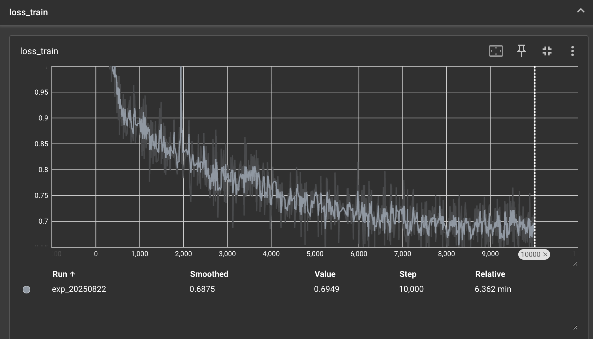

[English](./README.md)

# 从零开始的 LLM

本代码库包含一个从零开始用 PyTorch 实现的现代化仅解码器 Transformer 模型，专为教育目的而构建。它包含了现代语言模型的所有基本构建模块，以清晰、模块化和易于理解的方式编写。该项目的目标是为学习如何从头开始构建大型语言模型提供一个全面的资源。

## 特性

*   **从零开始实现：** Transformer 模型的每个组件都使用 PyTorch 从零开始实现，从而深入理解其底层机制。
*   **现代化架构：** 该模型融合了最先进语言模型中使用的现代技术，包括：
    *   **RMSNorm：** 用于高效稳定的层归一化。
    *   **SwiGLU：** 前馈网络中的激活函数，以提高性能。
    *   **旋转位置嵌入 (RoPE)：** 用于有效的位置编码。
*   **分布式训练:** 支持使用分布式数据并行 (DDP) 在多个 GPU 上进行训练。
*   **自定义 BPE 分词器：** 从零开始实现的字节对编码 (BPE) 分词器，可以在任何文本语料库上进行训练。
*   **自定义优化器：** 包括 `AdamW` 和 `SGDDecay` 优化器的自定义实现。
*   **全面的训练和生成脚本：** 提供用于在大型语料库上训练模型以及使用训练好的模型生成文本的脚本。
*   **完备的测试：** 使用 `pytest` 和快照测试的全面测试套件确保了实现的正确性。

## 已实现的组件

该项目为构建和训练语言模型提供了一个完整的生态系统。关键组件包括：

### 核心模型 (`llm/transformer.py`)

*   **`Transformer`**：组合所有组件的主模型类。
*   **`TransformerBlock`**：Transformer 的单个模块，包含多头注意力和前馈网络。
*   **`MultiHeadAttention`**：多头自注意力机制。
*   **`ScaledDotProductAttention`**：核心注意力机制。
*   **`FFN`**：带有 SwiGLU 激活函数的位置前馈网络。
*   **`RoPE`**：用于注入位置信息的旋转位置嵌入。
*   **`RmsNorm`**：均方根层归一化。
*   **`Embedding`**：词元嵌入层。
*   **`Linear`**：自定义线性层。
*   **`Softmax`**：自定义 softmax 实现。
*   **`CrossEntropyLoss`**：自定义交叉熵损失函数。

### 分词器 (`llm/bpe_tokenizer.py`)

*   **`BpeTokenizer`**：从零开始实现的 BPE 分词器。它可以在语料库上进行训练，以学习词汇表和合并规则。它还支持特殊词元。

### 训练与推理

*   **`llm/training.py`**：用于训练 Transformer 模型的脚本。它包括数据加载、训练循环、验证和检查点。
*   **`llm/generating.py`**：用于使用训练好的模型通过 top-p 采样生成文本的脚本。
*   **`llm/checkpoint.py`**：用于保存和加载模型检查点的实用工具。

### 优化器和实用工具 (`llm/transformer.py`)

*   **`AdamW`**：AdamW 优化器的自定义实现。
*   **`SGDDecay`**：带有学习率衰减的 SGD 的自定义实现。
*   **`cos_lr_scheduler`**：带有预热的余弦学习率调度器。
*   **`gradient_clip`**：用于梯度裁剪的函数。

## 架构

本代码库中的 Transformer 模型是一个仅解码器模型，类似于 GPT 等模型的架构。它专为语言建模任务而设计。关键的架构特性是：

*   **预归一化：** 模型使用 RMSNorm 进行层归一化，它在注意力和前馈层*之前*应用。与后归一化相比，这能带来更稳定的训练。
*   **SwiGLU 激活函数：** 前馈网络使用 SwiGLU (Swish-Gated Linear Unit) 激活函数，该函数已被证明可以提高语言模型的性能。
*   **旋转位置嵌入 (RoPE):** 该模型不使用传统的位置嵌入，而是使用 RoPE 通过旋转注意力机制中的查询和键向量来合并位置信息。这是一种更有效处理长序列的方法。

## 使用方法

**注意:** 以下命令使用 `uv run`，这是一个在虚拟环境中运行命令的工具。如果您没有使用 `uv`，您可以将 `uv run` 替换为 `python`。例如，`uv run -m llm.training` 变为 `python -m llm.training`。

### 1. 准备数据

训练脚本期望训练和验证数据是内存映射的 NumPy 数组形式的词元 ID。您可以使用训练好的分词器将您的文本数据转换为此格式。

通过以下方式下载数据

```bash
mkdir -p data
cd data

wget https://huggingface.co/datasets/roneneldan/TinyStories/resolve/main/TinyStoriesV2-GPT4-train.txt
wget https://huggingface.co/datasets/roneneldan/TinyStories/resolve/main/TinyStoriesV2-GPT4-valid.txt

wget https://huggingface.co/datasets/stanford-cs336/owt-sample/resolve/main/owt_train.txt.gz
gunzip owt_train.txt.gz
wget https://huggingface.co/datasets/stanford-cs336/owt-sample/resolve/main/owt_valid.txt.gz
gunzip owt_valid.txt.gz

cd ..
```

### 2. 训练分词器

您可以使用 `llm/bpe_tokenizer.py` 脚本在您自己的文本语料库上训练 BPE 分词器。

准备用于训练的词元 ID。如果您有多个文件作为训练语料库，只需使用特殊词元 "<|endoftext|>" 将这些文件合并即可。

```bash

uv run -m llm.bpe_tokenizer
```

### 3. 训练模型

使用 `llm/training.py` 脚本来训练 Transformer 模型。

```bash
uv run -m llm.training
```

要进行分布式训练，请使用以下命令：

```bash
torchrun --standalone --nproc_per_node=2 -m llm.training
```

### 4. 生成文本

一旦您有了训练好的模型，就可以使用 `llm/generating.py` 来生成文本。

```bash
uv run -m llm.generating
```

## 数据检查

该项目包含一个用于检查训练和验证数据质量的脚本。`inspect_data.py` 脚本会检查令牌分布、特殊令牌的频率以及批次多样性。这对于确保您的数据适合训练非常有用。

要使用该脚本，请运行：

```bash
uv run inspect_data.py
```

## 基准测试

`kernel/benchmarking_model.py` 中提供了一个基准测试脚本，用于衡量 Transformer 模型的性能。该脚本可用于评估训练和推理速度。

要运行基准测试，请使用以下命令：

```bash
uv run kernel/benchmarking_model.py
```

## 测试

该项目有一个全面的测试套件，以确保实现的正确性。您可以使用 `pytest` 运行测试：

```bash
uv run pytest
```

测试覆盖范围：

*   通过将其输出与参考实现进行比较，来验证 Transformer 模型中每个模块的正确性。
*   BPE 分词器的编码和解码，以及其训练过程。
*   优化器和其他实用工具。
*   分布式训练设置。

## 训练

### 损失曲线



### 学习率表


## LLM 输出示例

在训练完 Tiny stories 数据集后，您可以使用训练好的模型，通过提示“tell you a story”来生成文本，可以得到以下输出。

```bash
Prompt: tell you a story
Completion:  about an a magic box. It said: "I know you can live there, and you can choose. You will see it and keep it in your heart. It will be fun and healthy."
Lily was amazed. She liked the heart. She liked the story. She wondered what the heart was. She wondered what was inside. She wanted to find out what the heart was.
"Please, Mr. Snowman. He is a gift from my story. He is very special. He is very special. He has a new heart and a smile. He is a symbol. He is a gift from his grandma. He is very proud of him. He wanted to be his friend. He took the heart and went to his room. He told Lily he was very smart and kind.
Lily was happy. She had made a new friend. She did not know that Mr. Snowman was a good friend. He had a very special heart. He had a friend. He had a heart and a hug. He could tell Lily about his heart. He had many friends. He did not hear any of the heart. He was a big, friendly dog. He liked to play with Lily. He liked to play with Lily. He had many friends.
<|endoftext|>

```

```bash
Prompt: tell you a story
Completion: ."
Tim and Sam looked at each other and started to laugh. They knew they were going to have a big party. They said sorry to each other and hugged. They played games and ate cake and shared their cookies. They were happy and loved.
<|endoftext|>
```

## 许可证

该项目根据 MIT 许可证授权。有关详细信息，请参阅 `LICENSE` 文件。

## 贡献

欢迎贡献！如果您有任何建议或发现任何错误，请随时提交拉取请求或开启一个 issue。

---
此 README 由 gemini-cli 生成。