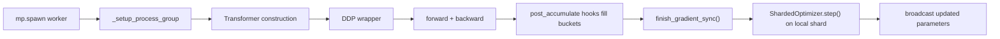

# Distributed Training and Sharded Optimizer

`parallel/` is where the repository stops relying on PyTorch's built-in distributed wrappers and exposes the communication mechanics directly. The code is compact, but it shows exactly when tensors are broadcast, reduced, and re-synchronized.

## Where the Distributed Path Starts

The top-level launcher is still `llm/training.py`. `train()` always calls:

```python
mp.spawn(
    _train,
    args=(args.world_size, args.backend, args),
    nprocs=args.world_size,
    join=True,
)
```

Each worker then runs `_setup_process_group()`, which:

- sets `MASTER_ADDR=localhost`
- sets `MASTER_PORT=12390`
- picks `device = f"cuda:{rank % torch.cuda.device_count()}"`
- calls `dist.init_process_group(...)`

After that, `_train()` makes two distributed decisions:

- `mini_batch_size = args.batch_size // world_size`
- if `world_size > 1`, wrap the model in `DDP` and replace `AdamW` with `ShardedOptimizer`

So single-rank and multi-rank execution share the same training loop. Only synchronization and optimizer ownership change.

## `parallel/ddp.py`: Custom Gradient Synchronization

The custom `DDP` class is intentionally thin. `forward()` just calls the wrapped module. The file exists to define:

- how parameters are synchronized at init
- when gradients enter communication buckets
- when the training loop is allowed to step the optimizer

### Initialization contract

During construction, the wrapper iterates over every parameter and runs:

```python
dist.broadcast(param.data, src=0)
```

Rank 0 is therefore the source of truth for initial weights. Even if local random initialization differed, the broadcast makes every replica identical before training starts.

For trainable parameters, the wrapper also registers:

```python
param.register_post_accumulate_grad_hook(
    lambda _, param=param: self._sync_gradients(param)
)
```

This hook fires after a parameter's gradient has been accumulated in backward. Communication therefore begins as soon as gradients appear, not only after the entire backward pass finishes.

### Bucket accumulation

`_sync_gradients()` does not launch one collective per gradient tensor. Instead it appends gradients to `self.grads_bucket` and tracks the bucket size in bytes:

```python
self.size += p.grad.numel() * p.grad.element_size()
```

Once the bucket crosses `bucket_size_mb`, `_sync_grads_in_buckets()`:

1. flattens the bucket with `torch._utils._flatten_dense_tensors`
2. launches `dist.all_reduce(..., async_op=True)`
3. stores the async handle together with the flattened tensor and original gradient views
4. clears the bucket

This matches the main idea behind framework DDP bucketization: fewer large collectives are cheaper than many tiny ones, and asynchronous handles create room for overlap with the remaining backward work.

### Backend-specific averaging

The file handles backend differences explicitly:

- NCCL uses `ReduceOp.AVG`
- GLOO uses `ReduceOp.SUM`, then divides by `world_size` later

So the gradient invariant stays the same even though the collective API is different.

### Explicit completion point

The training loop must call:

```python
model.finish_gradient_sync()
```

before `optimizer.step()`.

`finish_gradient_sync()` is where asynchronous communication becomes a completed training state. It:

1. flushes any partially filled bucket
2. waits on all outstanding handles
3. unflattens the reduced tensor back into the original gradient tensors

In this repo, "backward has returned" and "all gradients are globally synchronized" are deliberately not treated as the same event.

## `parallel/sharded_optimizer.py`: Optimizer-State Sharding

DDP reduces time-to-train, but not optimizer-state memory. With Adam-style optimizers, every rank would normally hold first and second moments for every parameter.

`ShardedOptimizer` keeps parameters and gradients replicated, but shards the optimizer state.

### How parameter ownership is assigned

`add_param_group()` receives the full parameter group and selects the subset owned by the current rank:

```python
for i, param in enumerate(full_params):
    if i % self.world_size == self.rank:
        sharded_params.append(param)
```

The wrapped inner optimizer is constructed only on that subset. Ownership is therefore determined by parameter order inside each param group.

### What `step()` actually does

`step()` performs three phases:

1. `_average_gradients()`
2. `self.optimizer.step()` on the locally owned parameters
3. `_synchronize_parameters()` to broadcast updated shards back to every rank

`_synchronize_parameters()` reuses the same modulo rule:

```python
owner_rank = i % self.world_size
dist.broadcast(p.data, src=owner_rank)
```

After that sweep, every worker once again holds a full, synchronized model even though only one rank updated each parameter locally.

### What is and is not sharded

With this design:

- parameters are replicated
- gradients are replicated
- optimizer state is sharded

So this is optimizer-state sharding, not a full ZeRO-style partition of all training state.

## Interaction Between DDP and ShardedOptimizer

In the default multi-rank pretraining path, both layers are active:

1. `DDP.finish_gradient_sync()` averages gradients through bucketed async all-reduce
2. `ShardedOptimizer.step()` runs its own `_average_gradients()` before the local optimizer step
3. updated parameter shards are broadcast back to all ranks

The important implementation detail is that communication responsibility is split across the two files rather than concentrated in one abstraction. `ShardedOptimizer` can average gradients on its own, but `llm/training.py` also asks the custom DDP wrapper to finish synchronizing before the optimizer step.

## Checkpoint and State Implications

Checkpointing remains deliberately simple:

- `save_checkpoint()` serializes `model.state_dict()`
- `save_checkpoint()` serializes `optimizer.state_dict()` exactly as returned

That has practical consequences in distributed runs:

- model state is saved from the wrapper object unless the caller unwraps `model.module`
- `ShardedOptimizer.state_dict()` proxies the local inner optimizer, so optimizer state is not consolidated across ranks before saving

The multi-rank path is therefore best read as a communication and memory-layout demonstration. The single-rank path is the easiest route for reusable training/inference artifacts.

## End-to-End Control Flow



## Why This Design Is Useful

The value of these files is not that they out-feature framework DDP. The value is that they expose the mechanics most high-level trainers hide:

- when parameters are broadcast
- when gradients enter communication buckets
- how async handles are stored and waited on
- how parameter ownership is chosen
- how a sharded local update becomes a fully synchronized model again

If you already know the textbook idea of DDP, this code answers the more practical question: which tensors move across the wire, and when?

## Limits of the Current Implementation

The design is intentionally narrow:

- no gradient compression
- no parameter or gradient sharding
- no consolidated optimizer checkpoint for multi-rank runs
- no separate checkpoint adapter that unwraps the custom DDP wrapper

That is consistent with the repository's goal. The code stays small enough that a reader can trace every collective from the training loop down to the exact call site.
