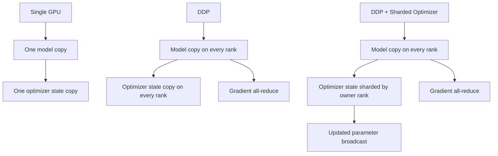

# Distributed Training and Sharded Optimizer

The repository does not delegate all multi-GPU logic to a framework wrapper. It implements its own distributed data parallel path in `parallel/ddp.py` and its own sharded optimizer in `parallel/sharded_optimizer.py`.

## What DDP Does Here

The custom DDP wrapper follows the standard data-parallel pattern:

1. each rank holds a model replica
2. each rank processes a shard of the batch
3. gradients are synchronized across ranks
4. parameter updates happen from the averaged gradient state

The interesting part is how the repo performs that synchronization.

## Parameter Broadcast on Initialization

During wrapper initialization, each parameter is broadcast from rank 0:

```python
dist.broadcast(param.data, src=0)
```

That guarantees all ranks start from the same parameter state.

## Post-Accumulate Gradient Hooks

For trainable parameters, the wrapper registers `register_post_accumulate_grad_hook(...)`.

That means the synchronization trigger is attached directly to gradient accumulation. Once a parameter gradient exists, the wrapper can queue it into a communication bucket.

This is more instructive than calling one bulk sync helper after every backward pass because it exposes where gradient communication really begins.

## Bucketed Synchronization

The DDP wrapper does not all-reduce every parameter gradient individually. It appends gradients to `grads_bucket` until the configured bucket size is reached.

Then it:

1. flattens the bucket
2. launches `dist.all_reduce(..., async_op=True)`
3. tracks the async handle

That reduces communication overhead compared with tiny per-parameter collectives and creates room for overlap between communication and remaining backward computation.

## Finish Step

Before the optimizer updates weights, `finish_gradient_sync()`:

- flushes any remaining bucket contents
- waits on all async handles
- clears internal tracking

The training loop in `llm/training.py` calls this explicitly before `optimizer.step()` when distributed mode is active.

## Sharded Optimizer

DDP alone still keeps a full optimizer state on every rank. For Adam-style optimizers, that means each rank stores moments for all parameters.

`ShardedOptimizer` reduces that memory pressure by assigning only a subset of parameters to each rank's underlying optimizer instance.

### Partitioning Rule

The partitioning is simple:

```python
if i % self.world_size == self.rank:
    sharded_params.append(param)
```

Each rank owns the optimizer state for only its shard of parameters.

### Update and Synchronization

At step time:

1. gradients are already synchronized or averaged
2. the local wrapped optimizer updates only the owned parameter shard
3. the updated parameter values are broadcast from the owning rank

That final broadcast re-synchronizes the full model weights across all ranks.

## Memory Tradeoff

The model parameters and gradients still exist on every rank, but optimizer-state memory is distributed across ranks.

That makes the sharded optimizer particularly useful when optimizer state, not parameters alone, is the memory bottleneck.



## Relationship to the Training Script

The training script chooses:

- `DDP + ShardedOptimizer` for multi-rank runs
- plain custom `AdamW` for single-rank runs

That makes the distributed path an extension of the same main training loop, not a separate training program.

## Why This Matters

This part of the repo is one of the clearest examples of its teaching value. Instead of telling the reader "DDP averages gradients and sharding saves memory," it shows the communication mechanics in working code:

- where the hooks are installed
- how gradients are bucketed
- how async handles are waited on
- how parameter ownership is partitioned
- how updated shards are broadcast back out
