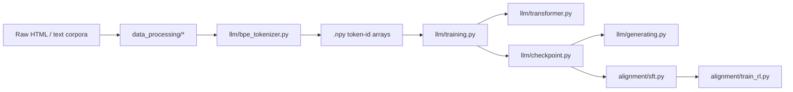

# Project Overview

This repository is best read as a complete training stack rather than a single model file. The implementation surface is deliberately split into a few ownership boundaries:

- `llm/` owns tokenizer, model, loss, optimizer utilities, pretraining loop, checkpointing, and generation.
- `kernel/` owns performance-sensitive attention implementations and benchmark scaffolding.
- `parallel/` owns multi-GPU communication and optimizer-state sharding.
- `data_processing/` owns corpus cleanup before tokenization.
- `alignment/` owns downstream supervised and reinforcement fine-tuning workflows.

The rest of this document explains how those pieces fit together as a runnable system.

## End-to-End System Path

The main lifecycle in this repo is:

1. Raw text is cleaned in `data_processing/`.
2. `llm/bpe_tokenizer.py` trains a byte-level BPE vocabulary and converts text into token-id arrays.
3. `llm/training.py` memory-maps those arrays, slices fixed-length next-token examples, and trains `Transformer`.
4. `llm/checkpoint.py` saves model and optimizer state.
5. `llm/generating.py` reloads the model plus tokenizer and performs top-p sampling.
6. `alignment/sft.py` and `alignment/train_rl.py` reuse an external base model checkpoint for downstream math alignment.

That split is important. Pretraining code is fully from-scratch PyTorch. Alignment code is intentionally more pragmatic and uses Hugging Face plus vLLM, because the repo wants to show both "mechanics from first principles" and "real downstream workflows."

## Core Stack: `llm/`

`llm/` is the densest part of the repository. It contains both primitive layers and the training script that consumes them.

### `llm/bpe_tokenizer.py`

This file owns the full byte-pair tokenization lifecycle:

- regex-based pre-tokenization
- special-token preservation
- byte vocabulary bootstrapping
- merge counting and merge learning
- greedy merge replay during encoding
- byte reconstruction during decoding
- tokenizer serialization

The key design decision is that vocabulary entries are stored as `bytes`, not Python strings. That keeps training and inference grounded in byte-level segmentation rather than Unicode character assumptions.

### `llm/transformer.py`

This is not just a model wrapper. It contains:

- `Linear`
- `Embedding`
- `RmsNorm`
- `Softmax`
- `ScaledDotProductAttention`
- `MultiHeadAttention`
- `MultiHeadAttentionWithRoPE`
- `RoPE`
- `SwiGlu`
- `TransformerBlock`
- `Transformer`
- `CrossEntropyLoss`
- custom `SGDDecay`
- custom `AdamW`
- cosine LR scheduling
- gradient clipping

The file therefore acts as both the model definition and the minimal optimization toolkit that the training script expects.

### `llm/training.py`

This file coordinates execution rather than just iterating over minibatches. It:

- seeds all RNG sources per rank
- configures distributed process groups
- memory-maps token arrays
- samples autoregressive windows
- constructs the model
- swaps in `DDP` and `ShardedOptimizer` when `world_size > 1`
- performs validation on rank 0
- clips gradients
- applies a cosine learning-rate schedule
- checkpoints model state

The training script is intentionally plain enough that a reader can map every high-level training concept to 1-2 functions.

### `llm/checkpoint.py` and `llm/generating.py`

Checkpointing is a small but important contract in the repo. The saved object contains:

- `model`
- `optimizer`
- `iteration`

`llm/generating.py` proves the contract is sufficient by reloading the same checkpoint, reloading the saved tokenizer, and sampling text autoregressively with temperature and top-p truncation.

## Performance Layer: `kernel/` and `parallel/`

The repo separates model definition from scale/performance concerns.

### `kernel/`

`kernel/flash_attention_triton.py` introduces a Triton Flash Attention implementation that reduces attention memory pressure by computing softmax statistics block by block instead of materializing the full score matrix.

`kernel/flash_attention_mock.py` serves as a slower, easier-to-read reference path. The benchmark scripts then measure whether the optimized path is actually worth using.

This means the repository treats kernel work as:

- algorithm design
- implementation
- validation
- performance measurement

rather than shipping an opaque optimized primitive with no explanation.

### `parallel/`

`parallel/ddp.py` implements gradient synchronization with:

- parameter broadcast at init
- post-accumulate gradient hooks
- bucketed flattening
- asynchronous `all_reduce`
- explicit wait and unflatten in `finish_gradient_sync()`

`parallel/sharded_optimizer.py` reduces optimizer-state memory by assigning parameter ownership to ranks with a simple modulo rule and broadcasting updated shards after the local optimizer step.

Together, those two files explain how the repo scales the same training loop from one GPU to multiple GPUs without delegating every detail to framework magic.

## Data Layer: `data_processing/`

The data pipeline exists because the repo assumes raw text is messy by default. The module boundary is:

- `html_process.py` for HTML-to-text conversion
- `language_identification.py` for FastText-based language gating
- `quality_filter.py` for cheap heuristic filtering
- `deduplicate.py` for exact and approximate duplicate removal
- `mask_pii.py` for regex-based sanitization
- `harmful_detect.py` for NSFW and toxicity classification
- `quality_classfier.py` for learned quality scoring

The important systems point is ordering. Cheap deterministic filters happen before more expensive or more semantic ones. That keeps large-scale preprocessing computationally tractable.

## Alignment Layer: `alignment/`

The alignment code deliberately shifts style. Instead of continuing the from-scratch pretraining stack, it uses the ecosystem tools that are standard for current large-model adaptation.

### `alignment/sft.py`

The SFT path:

- loads a base Hugging Face causal LM
- builds a GSM8K dataset with explicit `<think>` / `<answer>` formatting
- masks prompt tokens out of the supervised loss
- accumulates gradients
- evaluates through a separate vLLM instance

This is the repo's completion-only fine-tuning example.

### `alignment/train_rl.py`

The RL path adds:

- vLLM-based rollout generation
- a frozen reference model
- grouped reward normalization
- clipped policy-gradient objectives
- manual multi-GPU role partitioning
- periodic evaluation

That makes the repo useful not only for model internals, but also for modern post-training system design.

## Reading Order by Dependency

If you want to understand implementation details efficiently, read in this order:

1. `Tokenizer and Vocabulary`
2. `Transformer Core`
3. `Training Loop and Checkpointing`
4. `Flash Attention and Kernel Optimization`
5. `Distributed Training and Sharded Optimizer`
6. `Data Processing Pipeline`
7. `Supervised Fine-Tuning on gsm8k`
8. `Reinforcement Learning Fine-Tuning on gsm8k`

That order follows actual dependency flow: tokenization feeds pretraining; pretraining feeds optimization and checkpointing; performance features scale the same model; alignment workflows sit on top.

## What This Repository Is Optimizing For

The repo is not primarily optimizing for production packaging. It is optimizing for inspectability:

- each major concept has a dedicated file
- training uses explicit helper functions instead of deep callback stacks
- distributed and kernel work are separated from base-model logic
- alignment workflows are concrete enough to reproduce

That is why the docs are organized around ownership boundaries rather than around marketing categories. The fastest way to understand the project is to trace how tensors, checkpoints, and sampled responses move across those boundaries.
