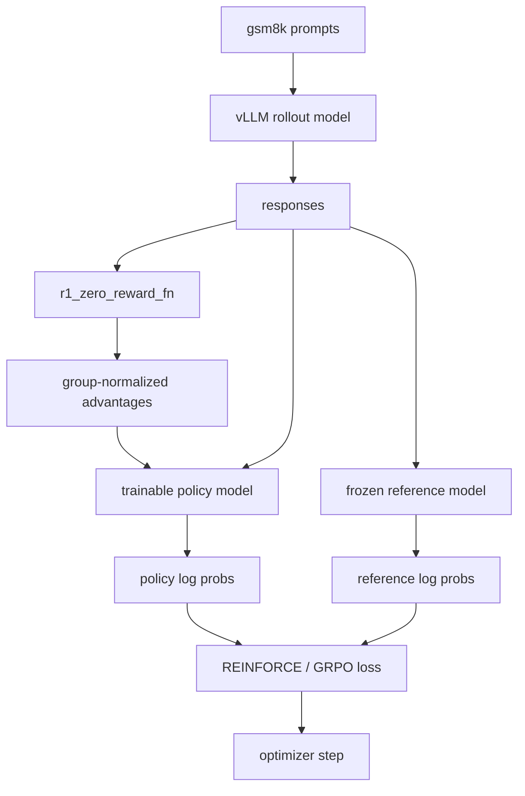

# Reinforcement Learning Fine-Tuning on gsm8k

The RLFT path keeps the same GSM8K task and the same `<think> / <answer>` response contract, but it replaces supervised next-token training with policy-gradient style updates. This chapter focuses on the code as it exists now: multi-role model placement, grouped rewards, response-only masking, and the exact loss variants implemented in `alignment/grpo.py`.

## File-Level Responsibilities

The RL workflow is split across:

- `alignment/train_rl.py` for orchestration and the main training loop
- `alignment/grpo.py` for reward normalization and policy-gradient losses
- `alignment/drgrpo_grader.py` for format plus math-answer rewards
- `alignment/evaluate.py` for batch evaluation
- `alignment/args.py` for CLI defaults

The dataset and prompt template are reused from the SFT path, so RL starts from the same task definition and output schema.

## Entrypoint and Checkpoint Source

The `__main__` block in `train_rl.py` parses both the RL arguments and the SFT arguments.

That is not accidental. The RL script uses:

```python
sft_args.checkpoint_path
```

as the base policy checkpoint when no RL checkpoint already exists.

The entrypoint logic is:

- if `args.checkpoint_path` already contains model weights, skip training and evaluate that RL checkpoint
- otherwise, start RL training from the SFT checkpoint path

So RLFT is implemented as a post-SFT stage, not as a standalone training branch from the raw Hugging Face base model.

## Role-Split Device Topology

`train_rl.py` assigns different jobs to different devices:

- `sample_model`: vLLM rollout generation
- `reference_model`: frozen log-prob reference
- `eval_model`: periodic evaluation
- `model`: trainable policy

The CLI defaults are:

- `sample_device = cuda:7`
- `reference_model_device = cuda:6`
- `eval_device = cuda:5`

All remaining visible GPUs are given to the trainable policy model through `partition_model_across_devices(args)`.

### How `partition_model_across_devices()` works

The function:

1. reads the total GPU count
2. removes the sampling, reference, and evaluation devices from the pool
3. picks the first remaining GPU as `main_gpu`
4. assigns `model.embed_tokens`, `lm_head`, and `model.norm` to `main_gpu`
5. spreads transformer layers across the remaining policy GPUs

The layer placement rule is:

```python
layers_per_gpu = math.ceil(num_layers / len(layer_gpus))
```

and layers are assigned sequentially.

In practice, that means the current implementation expects a machine with enough GPUs to keep rollout, reference, evaluation, and policy execution separate.

## Initialization Path

Inside `train(args, base_model_checkpoint_path)`, the runtime objects are created in this order:

1. `SummaryWriter`
2. vLLM `sample_model` from `base_model_checkpoint_path`
3. tokenizer from `args.model`
4. trainable Hugging Face policy model from `base_model_checkpoint_path`
5. frozen Hugging Face `reference_model` from `base_model_checkpoint_path`
6. `Gsm8kDataset` and `DataLoader`
7. `torch.optim.AdamW`

So both the rollout engine and the frozen reference model start from the same checkpoint as the trainable policy.

## Per-Step Data Flow

For each batch from `DataLoader`, the script receives:

- `prompts`
- supervised completions, which are ignored in RL mode
- `ground_truths`

It then repeats each prompt `group_size` times:

```python
grouped_prompts = [p for p in prompts for _ in range(group_size)]
grouped_ground_truths = [gt for gt in ground_truths for _ in range(group_size)]
```

If `loss_type == "no_baseline"`, the code forces `group_size = 1`. Otherwise it uses the configured group size.

## Rollout Generation

Rollouts are generated by vLLM with:

- `temperature = args.sampling_temperature`
- `top_p = args.sampling_top_p`
- `min_tokens = args.sampling_min_tokens`
- `max_tokens = args.sampling_max_tokens`
- `stop = ["</answer>"]`
- `repetition_penalty = 1.1`
- `include_stop_str_in_output = True`

The returned response texts are concatenated back with the prompts to form `full_texts`.

That means the policy-gradient code works on full prompt-plus-response tokenizations, then masks out the prompt region later.

## Reward Calculation and Group Normalization

The reward function is still `r1_zero_reward_fn`, so RL and SFT share the exact same downstream notion of success:

- valid format
- correct final answer

`compute_group_normalized_rewards()` in `alignment/grpo.py` then converts raw rewards into advantages.

The implementation is:

1. compute raw scalar rewards for every rollout
2. reshape them to `[n_prompts, group_size]`
3. subtract the group mean
4. optionally divide by the group standard deviation
5. flatten back to one vector

So the baseline is local to each prompt's sampled response group rather than global across the entire batch.

## Tokenization and Response Masking

The script tokenizes:

- grouped prompts by themselves
- full prompt-plus-response texts

Prompt lengths are recovered from the prompt attention mask, not from character counts. For each microbatch, the response mask is built as:

```python
start = mb_prompt_lengths[j].item()
end_pos = mb_attention_mask[j].sum().item()
response_mask[j, start:end_pos] = True
```

Then the mask excludes:

- padding tokens
- `eos_token_id`
- `bos_token_id`

So loss averaging only covers tokens the policy actually generated in the response span.

## Log Probabilities

For each microbatch, the trainable policy computes:

```python
policy_logits = model(...).logits
policy_log_probs = gather(log_softmax(policy_logits), input_ids)
```

The frozen reference model computes:

```python
old_logits = reference_model(...).logits
old_log_probs = gather(log_softmax(old_logits), input_ids).detach()
```

The reference forward pass runs under `torch.inference_mode()` and on its dedicated device, then moves logits back to the policy device.

## Loss Variants in `alignment/grpo.py`

`compute_policy_gradient_loss()` exposes three modes.

### `no_baseline`

Use raw reward directly:

```python
- reward * log_prob
```

This is the plain REINFORCE-style objective.

### `reinforce_with_baseline`

Use the group-normalized advantage instead of the raw reward:

```python
- advantage * log_prob
```

This reduces variance by centering each prompt's sampled responses around their group mean.

### `grpo_clip`

Use a clipped importance-ratio objective:

1. compute `log_ratio = policy_log_probs - old_log_probs`
2. exponentiate to get the importance ratio
3. clamp the ratio inside `[1 - cliprange, 1 + cliprange]`
4. multiply both unclipped and clipped ratios by the advantage
5. take the negative minimum

This is the most PPO-like mode in the repository, but it stays tokenwise and compact enough to read directly.

## Microbatch Backward and Gradient Accumulation

`grpo_microbatch_train_step()` does not just compute loss; it also calls `mean_loss.backward()` internally.

Before backward, it:

- computes per-token loss from the selected objective
- averages it with `masked_mean(...)` over the response tokens only
- divides by `gradient_accumulation_steps` when needed

`train_rl.py` computes:

```python
grad_acc_steps = math.ceil(total_samples / args.train_mini_batch_size)
```

and loops through the batch in microbatches, so one rollout batch can be trained with several backward passes before a single optimizer step.

After all microbatches:

- gradients are clipped with `clip_grad_norm_(..., max_norm=1.0)`
- `optimizer.step()` updates the policy
- `optimizer.zero_grad()` clears gradients

## Periodic Evaluation

Every `evaluate_freq` steps, the script:

1. saves the current policy to `args.tmp_checkpoint_path`
2. saves the tokenizer there as well
3. launches a fresh vLLM `LLM(...)` for evaluation
4. runs `evaluate_math(...)`
5. logs `score["avg_all_rewards"]` to TensorBoard
6. frees the temporary evaluation model

At the end of each full pass through the dataloader, it also saves the policy to `args.checkpoint_path`.

## End-to-End Role Split



## Current Implementation Boundaries

The most important current-state details are easy to miss if you only read the high-level idea.

### Rollout sampling is not hot-swapped

`sample_model` is initialized once from `base_model_checkpoint_path` and is not refreshed inside the training loop. So rollout generation comes from the starting checkpoint for the entire run unless the code is extended.

### The reference model is fixed

`reference_model` is also initialized once from the starting checkpoint. The commented-out block that would update the old policy is not active, so `grpo_clip` compares against a fixed reference rather than a periodically refreshed old policy.

### Some CLI options are scaffolding for future changes

The script already exposes configuration for different loss types, grouping, and temporary checkpoints, but the control flow is still intentionally small enough to inspect in one file.

## Why This Chapter Matters

This is the repository's clearest example of post-training systems work:

- task-specific reward design
- grouped sampling and variance reduction
- token-level policy-gradient masking
- multi-role GPU placement
- periodic offline evaluation against the same reward contract

It is not a full RLHF framework. It is a compact implementation that makes the moving parts visible enough for a reader to understand how the policy, the rollout engine, the reference model, and the evaluator interact.
