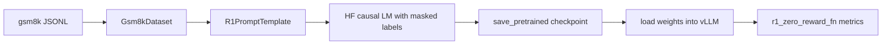

# Supervised Fine-Tuning on gsm8k

The SFT path is where the repository deliberately changes style. Pretraining in `llm/` is written from scratch. Post-training in `alignment/` uses the current large-model toolchain: Hugging Face for the trainable model, `accelerate` for device mapping, and vLLM for fast evaluation.

## File-Level Responsibilities

The SFT workflow is spread across a small cluster of files:

- `alignment/dataset.py` turns GSM8K JSONL into prompt/completion pairs
- `alignment/r1_prompt.py` owns the prompt and response formatting contract
- `alignment/sft.py` owns training, checkpointing, and epoch-end evaluation
- `alignment/evaluate.py` owns batch generation and metric aggregation
- `alignment/drgrpo_grader.py` owns format checking and math-answer grading
- `alignment/util.py` owns device-map construction and vLLM initialization
- `alignment/args.py` owns the CLI defaults

That split keeps the SFT script readable: data contract in one file, training loop in another, evaluation logic in another.

## Dataset Construction

`Gsm8kDataset` reads JSONL lines from `data/gsm8k/*.jsonl`. For each record it:

1. reads `question`
2. reads `answer`
3. splits `answer` on `####`
4. treats the prefix as reasoning text
5. treats the suffix as the final answer

It stores three parallel arrays:

- `self.data`: prompt strings
- `self.label`: supervised response strings
- `self.ground_truth`: final numeric/string answer

The prompt/response contract comes from `R1PromptTemplate`.

## Prompt and Response Contract

`R1PromptTemplate` loads a template file from disk and exposes three helpers:

- `gen_prompt(question)`
- `gen_response(think, answer)`
- `gen_all_corpus(question, think, answer)`

The important part is `gen_response()`:

```python
return think + "</think>" + " <answer>" + answer + " </answer>"
```

So the supervised target does not start from scratch. The prompt template already ends with `Assistant: <think>`, and the completion teaches the model how to finish the reasoning block and then emit a structured answer block.

That formatting contract is not cosmetic. The grader later requires the response to contain:

- `</think> <answer>`
- `</answer>`

## Default Configuration

`get_sft_parser()` defines the default runtime shape:

- model: `Qwen/Qwen2.5-Math-1.5B`
- dtype: `float32`
- `max_seq_len`: `1024`
- physical `batch_size`: `1`
- `gradient_accumulation_steps`: `8`
- training devices: `cuda:0` through `cuda:6`
- evaluation device: `cuda:7`
- checkpoint path: `checkpoints/math_sft`

So the default script assumes a fairly large local multi-GPU machine, with one GPU reserved for vLLM evaluation.

## Model Placement and vLLM Setup

`alignment/util.py` owns the device logic.

### Trainable HF model

`get_device_map()` builds an automatic multi-GPU device map by:

1. loading the model config
2. creating an empty model under `init_empty_weights()`
3. tying weights
4. calling `infer_auto_device_map(...)`

`sft.py` then loads the actual model with:

```python
AutoModelForCausalLM.from_pretrained(
    model_id,
    device_map=device_map,
    trust_remote_code=True,
)
```

### Evaluation model

The evaluation model is a separate vLLM instance created with `init_vllm(...)`. That helper monkey-patches:

- `torch.distributed.get_world_size` to return `1`
- a vLLM memory-footprint assertion

before constructing `LLM(...)`.

That implementation detail matters because it lets vLLM coexist with the multi-GPU Hugging Face model inside the same overall workflow.

## Completion-Only Loss Construction

The central implementation detail in `sft.py` is label masking.

For each batch:

1. read `prompts` and `completions`
2. concatenate `prompt + completion + eos`
3. tokenize the full texts with padding and truncation
4. tokenize the prompts separately with `add_special_tokens=False`
5. compute prompt lengths in tokens
6. clone `inputs.input_ids` into `labels`
7. set prompt-token positions in `labels` to `-100`
8. set padding-token positions in `labels` to `-100`

In code, the masking boundary is:

```python
for idx in range(len(prompts)):
    prompt_len = prompt_lengths[idx]
    labels[idx, :prompt_len] = -100

labels[labels == tokenizer.pad_token_id] = -100
```

That means optimization only applies to the completion region. The model is not trained to re-predict the prompt prefix.

## Training Loop

The training loop itself is intentionally short:

1. build the batch
2. compute the masked causal-LM loss through the Hugging Face model
3. divide the loss by `gradient_accumulation_steps`
4. call `loss.backward()`
5. step the optimizer every accumulation boundary
6. zero gradients after the step

The optimizer is standard `torch.optim.AdamW`, configured from CLI arguments:

- `lr`
- `beta1`
- `beta2`
- `weight_decay`

There is no custom scheduler, mixed-precision scaler, or sequence packing layer in this script. The important thing is the data contract and the completion-only loss.

## Epoch-End Evaluation

After each epoch, `sft.py` pushes the updated policy weights into the running vLLM instance through `load_policy_into_vllm_instance()`.

That helper reaches inside the vLLM engine:

```python
llm_model = llm.llm_engine.model_executor.driver_worker.model_runner.model
llm_model.load_weights(state_dict.items())
```

So evaluation reuses a live inference engine instead of recreating it from scratch every epoch.

`evaluate_math()` then:

1. loads GSM8K test data
2. rebuilds prompts with the same `R1PromptTemplate`
3. generates outputs with vLLM
4. scores each output with `r1_zero_reward_fn`
5. aggregates three metrics:
   - `avg_format_rewards`
   - `avg_answer_rewards`
   - `avg_all_rewards`

The evaluation sampling config is intentionally simple:

- `temperature=1.0`
- `top_p=1.0`
- `max_tokens=1024`

## Reward Function and Metrics

`r1_zero_reward_fn()` is the real evaluation contract.

It first checks the response format:

- does the text contain `</think> <answer>`?
- does it contain `</answer>`?

If not, all rewards are zero.

If the format is valid, the grader:

1. extracts the answer span
2. optionally unwraps `\boxed{...}`
3. calls `grade(...)`, which uses string normalization, symbolic parsing, and math-equivalence checks

The returned dictionary is:

```python
{
    "format_reward": ...,
    "answer_reward": ...,
    "reward": ...,
}
```

So SFT is not judged only by next-token loss. It is judged by the same downstream structure and answer correctness that RLFT later optimizes more directly.

## Checkpoint and Entrypoint Behavior

After evaluation, the script saves:

- `model.save_pretrained(args.checkpoint_path)`
- `tokenizer.save_pretrained(args.checkpoint_path)`

The `__main__` block then behaves as a small controller:

- if the checkpoint directory already exists and is non-empty, load it directly into vLLM and evaluate
- otherwise, run training first and then evaluate

So the same file acts as both trainer and "evaluate existing SFT checkpoint" entrypoint.

## End-to-End Flow



## Practical Consequences

The current SFT implementation makes a few deliberate choices:

- it uses the same prompt format that RLFT will later reuse
- it computes the loss boundary in token space, not character space
- it separates training and evaluation models so evaluation does not reuse the training graph
- it saves full Hugging Face checkpoints rather than a custom lightweight format

That combination makes the file a good bridge between educational model code and the more pragmatic ecosystem used for current large-model adaptation.
