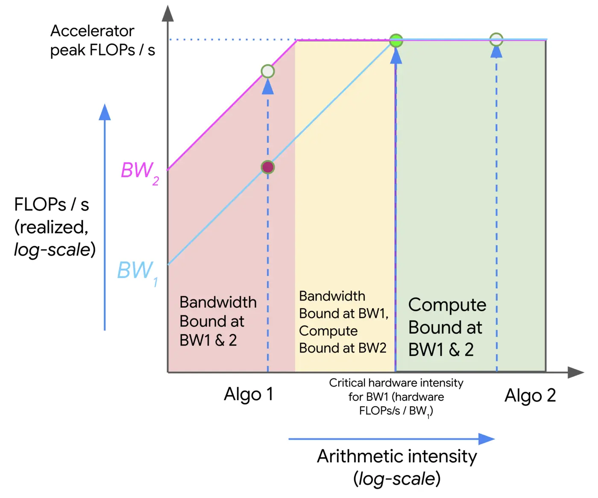

# LLM 入门基础知识

```{contents} 本页目录
---
depth: 2
local: true
---
```

## 资源核算

如果要在 1024 张 H100 上训练一个 70B 参数模型，训练 15T tokens，大概要多久？

常见估算 `6 * 参数量 * token 数`，得到总训练量约 `6.3e24` FLOPs；假设 H100 的 dense bf16 峰值按 `1979e12 / 2` FLOP/s 计、MFU 为 0.5，1024 张卡每天可提供约 `4.38e22` 有效 FLOPs，对应训练时间约 `144` 天。

8 张 80GB H100，使用 AdamW 时最大能训练多大的模型？

如果只看参数、梯度和 optimizer state，bf16 参数 2 bytes、bf16 梯度 2 bytes、AdamW 的两个 fp32 状态共 8 bytes，每个参数合计约 12 bytes。8 张卡共 640GB，粗略上限约 `5.33e10` 参数，也就是 53B 量级。这个数还没算 activation，因此只是上界。

## Tensor 是所有状态的共同载体

在语言模型训练中，几乎所有对象最终都是 tensor：数据、参数、梯度、optimizer state 和 activation 都以 tensor 形式存在。Tensor 的 rank 表示维度数，例如向量是 rank 1，矩阵是 rank 2，Transformer 中常见的 activation 往往是 rank 4，例如 `[batch, sequence, heads, hidden]`。

资源核算的第一步是知道一个 tensor 占多少内存。内存占用由元素个数和每个元素的 dtype 决定。例如一个 `4 x 8` 的 fp32 tensor 有 32 个元素，每个元素 4 bytes，因此占 128 bytes。

GPT-3 feed-forward 层中的一块矩阵如果形状为 `12288 * 4` by `12288`，fp32 下单矩阵就约 2.3GB。

## 低精度不是省内存这么简单

fp32 是传统科学计算的基准格式，动态范围和精度都较充足，但内存成本高。fp16 把每个值降到 2 bytes，可以显著降低内存，却容易在很小的数上 underflow； `torch.tensor([1e-8], dtype=torch.float16)` 会变成 0。

bf16 同样是 2 bytes，但保留了接近 fp32 的动态范围，只牺牲更多尾数精度，因此更适合深度学习训练。混合精度训练的常见策略是：参数、activation 和梯度用 bf16，optimizer state 用 fp32 累积，保证长期统计量更稳定。

下图展示 bf16 的 bit layout：它用更少尾数换取接近 fp32 的指数范围。


再往下，H100 支持 FP8 的 E4M3 和 E5M2 两种格式，NVFP4 则把单值压到 4 bits，并通过 block-level scale factor 扩大有效动态范围。这些低精度能力通常由 NVIDIA 库封装，应用层不总是直接控制每个细节，但理解它们能帮助判断训练和推理的 memory budget。

## CPU 与 GPU：tensor 放在哪里决定了计算路径

PyTorch tensor 默认在 CPU memory 中。要利用 GPU 的大规模并行能力，tensor 必须显式移动到 GPU memory，或者在 GPU device 上直接创建。这个看似简单的 `x.to(device)` 背后，其实就是把数据从主机侧搬到设备侧，后续 kernel 才能在 GPU 上执行。

下图展示 CPU 与 GPU memory/compute 的关系，是理解后续带宽瓶颈的起点。


这也是为什么只看 Python 代码很容易误判性能。表达式 `x @ w` 在语义上是矩阵乘法，但实际执行涉及 kernel launch、HBM 读写、片上计算和结果写回。资源核算关注的不是“代码写起来像一行”，而是这行代码触发了多少数据移动和多少浮点运算。

## Einops：给 tensor 维度命名，减少形状错误

传统 PyTorch 代码常用负数维度，例如 `y.transpose(-2, -1)`，一旦 tensor rank 变化就容易出错。einops 的价值是把维度命名，让 einsum、reduce、rearrange 的语义更接近数学表达。

```python
z = einsum(
    x,
    y,
    \"batch seq1 hidden, batch seq2 hidden -> batch seq1 seq2\",
)
```

这个例子说明，输出里没有出现的维度会被求和；如果需要支持任意前缀维度，可以用 `...` 表示 broadcast 维度。对于 Transformer 代码来说，命名维度能减少 batch、sequence、head、hidden 混淆，尤其适合教学和调试。

## FLOPs 与 FLOP/s：一个是工作量，一个是速度

Lecture 2 特别强调了两个读音相近但含义不同的术语：FLOPs 是 floating-point operations，表示完成了多少浮点操作；FLOP/s 或 FLOPS 是每秒浮点操作数，表示硬件或实际程序的速度。训练 GPT-3 曾被估算为 `3.14e23` FLOPs，GPT-4 的训练量被外界推测为 `2e25` FLOPs，这些数字衡量的是总计算工作量。

在 H100 上，矩阵乘法的理论峰值取决于 dtype；一次示例运行得到实际吞吐约 `5.34e13` FLOP/s，对应 promised FLOP/s 约 `6.75e13`，MFU 约 `0.79`。这里的 MFU 定义为实际 FLOP/s 除以硬件承诺 FLOP/s，忽略通信和额外开销；通常 MFU 达到 0.5 已经不错。

## Arithmetic intensity：判断 memory-bound 还是 compute-bound

为什么 MFU 很难接近 1？答案来自 compute 与 memory 的相对速度。一次计算通常需要三步：从 memory 把输入送到 accelerator，在 accelerator 上计算，再把输出写回 memory。总耗时取决于计算速度和内存带宽，如果通信时间大于计算时间，就是 memory-bound；如果计算时间大于通信时间，就是 compute-bound。

下图概括了从 memory 到 accelerator 再写回 memory 的基本执行路径。


Lecture 2 用 arithmetic intensity 来量化这一点：它表示每搬运 1 byte 数据能做多少 FLOPs。H100 的 accelerator intensity 约为 `295` FLOPs/byte。ReLU 的 arithmetic intensity 约为 `0.25`，GeLU 虽然算子更复杂，也只有约 `5.0`；dot product 约 `0.5`，matrix-vector product 约 `1.0`，这些都远低于 H100 的硬件强度，因此是 memory-bound。大矩阵乘法的 arithmetic intensity 在示例中约为 `341`，超过硬件强度，才终于变成 compute-bound。

下图是 roofline 模型：不同 workload 的 arithmetic intensity 决定了它落在带宽限制区还是算力限制区。



这个结论解释了很多 LLM 系统现象。训练阶段包含大量大矩阵乘法，容易把 accelerator 打满；而 decode 阶段更像 matrix-vector product，需要反复读取权重和 KV cache，因此经常被内存带宽限制。

## 反向传播的计算账：为什么是 6 * tokens * parameters

训练不仅有 forward，还有 backward。用一个简单线性模型说明 `loss.backward()` 如何产生梯度，再把视角放到一个多层线性网络。对某一层 `h2 = h1 @ w2` 来说，forward 的矩阵乘法大约需要 `2 * B * D * D` FLOPs；backward 需要同时计算 `h1.grad` 和 `w2.grad`，大约是 forward 的 2 倍。

下图展示一个深层网络，可用于理解 forward activation 与 backward gradient 的关系。


把所有层合起来，可以得到常用训练估算：forward 约为 `2 * 数据点数 * 参数量` FLOPs，backward 约为 `4 * 数据点数 * 参数量` FLOPs，总计约为 `6 * 数据点数 * 参数量` FLOPs。虽然这是从 MLP 推导来的简化结果，但对短上下文 Transformer 也是一个有用近似。

## Optimizer state 与 activation memory：显存账本不能只算参数

显存核算里，参数只是其中一项。以 AdamW 为例，训练时通常需要存参数、梯度、optimizer state 和 activation。bf16 参数每个 2 bytes，bf16 梯度每个 2 bytes；AdaGrad 的二阶累积状态需要 4 bytes/parameter，Adam 则因为一阶和二阶状态都要存，通常需要 8 bytes/parameter。

activation memory 又跟 batch size、hidden dimension 和 layer 数相关。大 batch 往往能提升训练稳定性，但 batch 越大，训练中需要保留的 activation 越多，越容易触碰显存上限。Gradient accumulation 的作用就是把大 batch 拆成多个 micro-batch：每个 micro-batch 做 forward/backward 并累积梯度，等累计到目标 batch 后再更新参数。

| 对象 | 典型 dtype / 成本 | 为什么要算 |
|-|-|-|
| Parameters | bf16，约 2 bytes/parameter | 模型本体，训练和推理都要常驻 |
| Gradients | bf16，约 2 bytes/parameter | 训练 backward 后保存，用于参数更新 |
| Optimizer state | Adam 约 8 bytes/parameter | 一阶、二阶统计量通常用 fp32 保持稳定 |
| Activations | 随 batch、sequence、hidden、layer 增长 | 训练 backward 需要保留或重算，中大 batch 时经常成为显存瓶颈 |

## Activation checkpointing：用更多计算换更少显存

训练时需要保留每层 activation，推理时则通常只需要当前层 activation，因为不需要 backward。Activation checkpointing，也叫 gradient checkpointing 或 rematerialization，核心思想是在 forward 阶段只保留一部分层的 activation；到 backward 时，再从最近 checkpoint 重新计算缺失的 activation。

这个技术本质上是在 memory 和 compute 之间做交换。每层都存 activation 时，activation memory 是 `O(L)`，几乎没有重算；完全不存时，memory 可以接近 `O(1)`，但 backward 可能反复从头重算，compute 变成 `O(L^2)`；每隔 `sqrt(L)` 层存一次 checkpoint，则 activation memory 约为 `O(sqrt(L))`，重算开销保持在 `O(L)` 量级。
