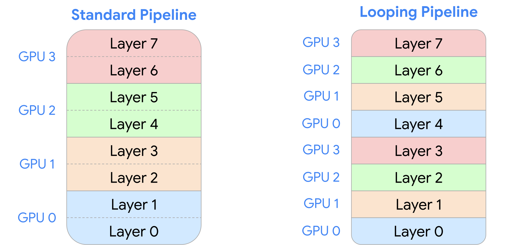

# 分布式训练/推理

```{contents} 本页目录
---
depth: 2
local: true
---
```

单卡优化关注的是同一张 GPU 内部的数据移动：能不能少访问 HBM，能不能把中间结果留在 shared memory 或 register 里，能不能让 tensor core 吃饱。多 GPU 训练把问题放大了一层：参数、梯度、optimizer state 和 activation 不一定放得进一张卡；即使放得进，也可能需要更多 GPU 来缩短训练时间。此时真正要算清楚的不只是 FLOPs，还有哪些状态被复制、哪些状态被切分，以及每一步需要跨 GPU 搬多少字节。

这一讲的核心可以概括成一句话：并行训练是在 compute、memory 和 communication 之间重新分账。数据并行把 batch 切开，但参数和 optimizer state 仍然复制；张量并行把层的宽度切开，但每层之间要频繁交换 activation；流水线并行把层的深度切开，但要处理 micro-batch 和 pipeline bubble。理解这些策略之前，先要把通信原语和硬件层级放进同一个心智模型里。


## 从单卡到多卡：瓶颈从 HBM 扩展到互联

多 GPU 系统仍然遵循同一个基本原则：计算单元很快，数据离计算越远越贵。单卡内，最快的是 L1 cache、shared memory 和 register，远一些是 HBM；多卡以后，还要经过 NVLink、NVSwitch、PCIe、InfiniBand 或 Ethernet。通信成本可以粗略写成：

配图可以把这个层级看得更直观：单节点内 GPU 通过 NVLink/NVSwitch 互联，跨节点时再进入 InfiniBand 或 Ethernet 这类更慢的网络路径。


$$T_{\mathrm{comm}}\approx \alpha+\frac{\mathrm{bytes}}{\mathrm{bandwidth}}$$

其中 $\alpha$ 是一次通信的固定延迟，后半项是数据量除以链路带宽。大张量通信时带宽项主导，小张量高频通信时延迟项也会很明显。这就是为什么并行策略不能只看“每张卡算多少 FLOPs”，还要看“每层、每步、每个 micro-batch 要通信多少次”。

| 层级 | 典型位置 | 量级直觉 | 优化含义 |
|-|-|-|-|
| shared memory / L1 | 单 GPU、单 SM 附近 | 最快、容量小 | 适合 tile、partial sum、kernel fusion |
| HBM | 单 GPU 显存 | B200 量级可到 $8\ \mathrm{TB/s}$ | 单卡 kernel 的主要内存账本 |
| NVLink / NVSwitch | 单节点多 GPU | B200 NVLink 5.0 量级约 $1.8\ \mathrm{TB/s}$ | 适合高频张量并行通信 |
| InfiniBand | 跨节点 GPU | 量级约 $0.05\ \mathrm{TB/s}$ | 适合较粗粒度的同步和分片策略 |
| Ethernet | 普通跨机器网络 | 传统设置可能只有 $200\ \mathrm{MB/s}$ 量级 | 需要尽量减少高频通信 |

因此，多卡训练不是简单把一份 PyTorch 代码扔到多张 GPU 上。一个可扩展实现必须回答三个问题：每个 rank 持有哪些 tensor；每一步哪些 tensor 要跨 rank 同步；这些同步发生在 NVLink 域内，还是要跨节点走更慢的网络。

## 通信原语：rank、world size 和 collective operations

分布式程序里，一张 GPU 或一个进程通常叫一个 rank；总 rank 数叫 world size，记作 $p$。collective operation 描述的是多个 rank 共同参与的通信模式。它比手写点对点 send/recv 更高层，因为运行时可以根据真实拓扑选择更好的路径。

下面的 rank 图可以先固定术语：rank 是参与通信的单个执行者，world size 是这个通信组里的执行者数量。


| 原语 | 语义 | 训练里的直觉用途 |
|-|-|-|
| broadcast | 一个 rank 的 tensor 复制到所有 rank | rank 0 读取 checkpoint 后同步给其他 rank |
| scatter | 一个 rank 把 tensor 切片分发给多个 rank | 理解 reduce-scatter 的基础 |
| gather | 多个 rank 的切片收集到一个 rank | 理解 all-gather 的基础 |
| reduce | 多个 rank 的 tensor 做 sum、min、max 等归约，结果到一个 rank | 聚合梯度或指标 |
| all-gather | gather 的结果发给所有 rank | 参数分片后，前向前拼出完整参数 |
| reduce-scatter | 先 reduce，再把结果切片分给各 rank | 梯度求和后只保留本 rank 负责的分片 |
| all-reduce | reduce 的结果出现在所有 rank | DDP 中同步所有 rank 的梯度 |
| all-to-all | 每个 rank 都向每个 rank 发送不同切片 | MoE 中把 token 路由到对应专家所在 rank |

以 all-reduce 为例，令第 $r$ 个 rank 上的输入向量为 $x_r$，sum all-reduce 的输出是：

$$y=\sum_{r=0}^{p-1}x_r$$

关键是每个 rank 最终都得到同一个 $y$。如果输入分别是：

$$x_0=[0,1,2,3],\quad x_1=[1,2,3,4],\quad x_2=[2,3,4,5],\quad x_3=[3,4,5,6]$$

那么 all-reduce 后每个 rank 都拿到：

$$y=[6,10,14,18]$$

reduce-scatter 则只保留归约结果的一片。还是上面的输入，rank 0 到 rank 3 分别得到 $[6]$、$[10]$、$[14]$、$[18]$。再接一个 all-gather，又会回到每个 rank 都拥有 $[6,10,14,18]$。所以一个非常重要的等价关系是：

$$\operatorname{all_reduce}=\operatorname{reduce_scatter}+\operatorname{all_gather}$$

这个拆法不是只为了记术语。DDP 选择 all-reduce，是因为每个 rank 都保留完整参数；FSDP/ZeRO 更关心显存，所以常把完整状态切成分片，需要时 all-gather，用完后 reduce-scatter，把存储压力从“每卡一整份”变成“每卡一部分”。

### PyTorch distributed：代码里真正发生了什么

在 PyTorch 里，collective operations 通过 `torch.distributed` 暴露出来。GPU 场景通常使用 `nccl` backend，CPU 或无 CUDA 场景可以用 `gloo`。初始化时需要让所有进程知道 master 地址、端口、自己的 rank 和 world size：

```python
def setup(rank: int, world_size: int):
    os.environ["MASTER_ADDR"] = "localhost"
    os.environ["MASTER_PORT"] = "15623"

    if torch.cuda.is_available():
        dist.init_process_group("nccl", rank=rank, world_size=world_size)
    else:
        dist.init_process_group("gloo", rank=rank, world_size=world_size)
```

一个最小的 collective 示例会在每个 rank 上各自执行同一段函数。all-reduce 会原地修改 `data`，reduce-scatter 需要单独的 `output` buffer，all-gather 又把每个 rank 的小片收回到完整向量：

```python
data = tensor([0., 1, 2, 3], device=cuda_if_available(rank)) + rank
dist.all_reduce(tensor=data, op=dist.ReduceOp.SUM, async_op=False)

input = torch.arange(world_size, dtype=torch.float32, device=cuda_if_available(rank)) + rank
output = torch.empty(1, device=cuda_if_available(rank))
dist.reduce_scatter_tensor(output=output, input=input, op=dist.ReduceOp.SUM, async_op=False)

input = output
output = torch.empty(world_size, device=cuda_if_available(rank))
dist.all_gather_into_tensor(output_tensor=output, input_tensor=input, async_op=False)
```

NCCL 的职责是把这些高层 collective 翻译成 GPU 之间的底层通信。它会探测节点、交换机、NVLink、PCIe 等拓扑，选择数据路径，并发起 GPU kernel 来发送和接收数据。这里的重点是：通信不是 CPU for 循环搬 tensor，而是由运行时和 GPU 通信库共同组织的一套数据移动计划。

跨节点时还会遇到 CPU 是否参与的问题。普通 Ethernet 路径通常要经过 CPU：数据拷到 kernel socket buffer，构造 TCP 包，再放进 NIC ring buffer。RDMA 则允许一端设备直接读写另一端设备内存，绕过 CPU 参与；InfiniBand 原生支持 RDMA，RoCE 则是在 Converged Ethernet 上实现类似能力。对大模型训练来说，这些网络细节会直接反映到 collective 的延迟和带宽上。

### 带宽怎么核算：看 duration 之前先看 bytes

通信 benchmark 不能只看某次 all-reduce 跑了几毫秒，还要知道这几毫秒里理论上移动了多少字节。示例分析 all-reduce 的有效带宽如下：

$$s=\operatorname{element_size}(x)\cdot\operatorname{numel}(x)$$

$$\mathrm{sent_bytes}=2s(p-1)$$

$$B_{\mathrm{allreduce}}=\frac{2s(p-1)}{p\cdot t}$$

其中 $p$ 是 world size，$t$ 是单次 collective 的观测耗时。公式里的 $2$ 来自 send 和 receive 两个方向；分母里的 $p$ 是把所有 rank 的耗时合并成总传输时间的估算口径。

```python
size_bytes = data.element_size() * data.numel()
sent_bytes = size_bytes * 2 * (world_size - 1)
total_duration = world_size * duration
bandwidth = sent_bytes / total_duration
```

reduce-scatter 的输入在每个 rank 上是 `world_size x num_elements`，它只把归约结果的一片留在本 rank，所以代码里的估算是：

$$B_{\mathrm{rs}}=\frac{s_{\mathrm{input}}(p-1)}{p\cdot t}$$

```python
data_bytes = input.element_size() * input.numel()
sent_bytes = data_bytes * (world_size - 1)
total_duration = world_size * duration
bandwidth = sent_bytes / total_duration
```

在 $p=4$、$\operatorname{num_elements}=100\cdot1024^2$ 的一次运行里，stdout 给出了这样的结果：

| collective | rank 0 | rank 1 | rank 2 | rank 3 | 读法 |
|-|-|-|-|-|-|
| all-reduce 时间 | 1.60 ms | 1.50 ms | 1.38 ms | 1.38 ms | 所有 rank 都要完成同步，尾部 rank 会影响 step |
| all-reduce 带宽 | 366 GB/s | 390 GB/s | 426 GB/s | 425 GB/s | 链路和拓扑已被 NCCL 优化，但仍是实打实的数据移动 |
| reduce-scatter 时间 | 2.61 ms | 2.47 ms | 2.39 ms | 2.39 ms | 操作语义不同，不能只拿绝对时间直接比 |
| reduce-scatter 带宽 | 450 GB/s | 475 GB/s | 490 GB/s | 490 GB/s | 按数据量归一化后，看到的是相近量级的通信能力 |

这个 benchmark 的价值不是得出某个固定数字，而是建立一个工程习惯：分布式训练慢了，先把通信的 tensor shape、dtype、参与 rank 数和频率写成账本，再判断瓶颈是在计算、HBM、NVLink 还是跨节点网络。

## 数据并行：切 batch，复制模型

数据并行是最直接的训练扩展方式。给定一个 batch：

数据并行的图示可以读成“横向切样本，纵向复制模型”：每个 rank 拿到不同 mini-batch shard，但拥有同一套层参数。


$$X\in\mathbb{R}^{B\times d}$$

用 $p$ 个 rank 训练时，第 $r$ 个 rank 处理：

$$X_r=X\left[\frac{rB}{p}:\frac{(r+1)B}{p},:\right]\in\mathbb{R}^{(B/p)\times d}$$

每个 rank 都持有完整参数 $\theta$ 和自己的 optimizer state。前向和反向在本地 batch 上计算，因此本地 loss 可以不同；关键是反向之后把梯度平均：

$$g=\frac{1}{p}\sum_{r=0}^{p-1}\nabla_{\theta}L_r$$

所有 rank 用同一个 $g$ 做 optimizer step，参数就能保持一致。

训练 loop 和单卡几乎一样，唯一多出来的关键步骤是对每个参数的 gradient 做 all-reduce：

```python
loss.backward()

for param in params:
    dist.all_reduce(tensor=param.grad, op=dist.ReduceOp.AVG, async_op=False)

optimizer.step()
```

这也是 DDP 的本质：每张卡都算一小块数据，但在参数更新前把梯度同步成一致。它的优点是简单、吞吐扩展直接；缺点也很清楚，参数、梯度和 optimizer state 没有被省掉。对 AdamW 来说，除了参数本身，还要维护一阶矩和二阶矩，显存压力会很快超过一张卡的容量。


### 复制模型之后，真正要优化的是梯度同步

数据并行（Data Parallelism，DP）把全局 batch 切给多个 worker；分布式数据并行（Distributed Data Parallel，DDP）是它的同步复制实现，在每个 worker 上保留完整模型和优化器状态。`world size` 是进程组中的 worker 总数，`global rank` 是其中一个 worker 的唯一编号；跨节点时还要区分同一节点内的 `local rank`。单机“一进程一卡”时两者数值常相同，多机时却不能混用。GPU 通信通常使用 NCCL，CPU 本地调试可以使用 Gloo。


*图 5：两节点、八进程时 global rank、local rank 与 node rank 的关系。原图来源于 Lightning distributed communication 文档；*

设全局批包含 $B$ 个样本，使用 $N_{DP}$ 个 rank，并假设各 rank 的本地 batch 等大、loss 采用相同的归约方式。每个 rank 处理 $B/N_{DP}$ 个互不重叠的样本，独立完成前向与反向，得到局部梯度。随后 all-reduce 汇总这些梯度，并按 world size 归一化为样本级全局平均梯度，使每个 rank 拿到相同结果；只要初始参数一致，之后各自执行同样的优化器更新，模型就继续保持同步。若各 rank 的有效样本数或 token 数不同，则不能直接做 rank 平均，而要按实际贡献数加权。

### Ring all-reduce 的带宽账

先考虑一个忽略链路延迟、只看出口带宽的理想模型。共有 $N$ 个设备，每个设备出口带宽为 $W$ 字节/秒，需要归约的完整张量大小为 $S$ 字节。

reduce-scatter 让每个 rank 从一份完整输入出发，跨 rank 对对应元素做归约，并最终只保留归约结果的一个分片；all-gather 则反过来，让每个 rank 从一个不同分片出发，最终拼出完整张量。

Ring reduce-scatter 经历 $N-1$ 轮；每轮每个设备发送 $S/N$ 字节，因此：

$$T_{RS}=\frac{N-1}{N}\frac{S}{W}.$$

Ring all-gather 具有相同的轮数和字节量：

$$T_{AG}=\frac{N-1}{N}\frac{S}{W}.$$

把两者串起来即可实现 all-reduce：

$$T_{AR}=2\frac{N-1}{N}\frac{S}{W}.$$

这个式子揭示了一个重要事实：设备数增大时，每张卡的本地计算会因批切分而持续减少，但对一份完整模型梯度的通信字节不会同比消失。最终，训练会从计算受限转向通信受限。

最朴素的 DDP 在反向全部结束后，对每个参数梯度单独执行 all-reduce。它有两个问题：调用次数多，每次都有固定开销；而且通信完全暴露在反向之后。

把全部梯度扁平化后一次 all-reduce，可以减少调用开销，却必须等最后一个梯度产生才开始通信。另一端是：为参数注册反向 hook，某个梯度一就绪便发起异步 all-reduce，并在优化器更新前等待所有 handle。这样能把通信藏在后续反向计算之下，但过多小消息又可能让调用开销与链路利用率恶化。

这形成了一个不能只凭直觉决定的取舍：全量合并优先减少调用次数，逐参数异步则优先提前通信。哪一种更快，取决于参数张量大小分布、反向计算时序和通信系统的实际开销，必须在相同训练配置下测量。

判断重叠是否有效，也不能只看“异步 API 已经调用”。必须在时间线上确认通信 kernel 与反向 kernel 确实并行，并观察反向结束后仍裸露多少通信尾巴。

### DDP 模型训练示例

基于分布式数据并行（DDP）进行训练：每个进程负责一个 rank，各自拿到同一份 memmap 数据、在各自设备上做前向/反向，并在需要时进行梯度同步与参数更新。

总体流程：

- 进程初始化与随机种子。
- 数据加载：训练/验证数据用 np.load(..., mmap_mode="r") 打开为只读内存映射，避免把整个 .npy 一次性读入内存。
- 模型初始化：使用上面章节实现的模块构建 Transformer，并进行 DDP(model) 包装。
- 优化器选择：多卡用 ShardedOptimizer(..., AdamW,...)（参数/状态可能做了切分），单卡直接用

torch.optim.AdamW（llm/training.py:118-llm/training.py:132）。

以下ShardedOptimizer 封装了 DDP 训练细节：实现梯度的broadcast (也可以直接使用all-reduce)：

```python
class ShardedOptimizer(Optimizer):
    def __init__(
        self, params: Iterable[Dict], optimizer_cls: Type[Optimizer], **kwargs: Any
    ):
        if dist.is_initialized():
            self.rank = dist.get_rank()
            self.world_size = dist.get_world_size()
        else:
            self.rank = 0
            self.world_size = 1

        self._optimizer_cls = optimizer_cls
        self._optimizer_kwargs = kwargs

        self.optimizer: Optimizer

        super().__init__(params, kwargs)

    def add_param_group(self, param_group: Dict[str, Any]) -> None:
        full_params = list(param_group["params"])

        sharded_params = []
        for i, param in enumerate(full_params):
            if i % self.world_size == self.rank:
                sharded_params.append(param)

        sharded_param_group = {k: v for k, v in param_group.items() if k != "params"}
        sharded_param_group["params"] = sharded_params

        if not hasattr(self, "optimizer"):
            self.optimizer = self._optimizer_cls(
                [sharded_param_group], **self._optimizer_kwargs
            )
        else:
            self.optimizer.add_param_group(sharded_param_group)

        super().add_param_group(param_group)

    def _average_gradients(self) -> None:
        if self.world_size == 1:
            return

        backend = dist.get_backend()
        for group in self.param_groups:
            for p in group["params"]:
                if p.grad is not None:
                    if backend == "nccl":
                        dist.all_reduce(p.grad.data, op=dist.ReduceOp.AVG)
                    else:
                        dist.all_reduce(p.grad.data, op=dist.ReduceOp.SUM)
                        p.grad.data /= self.world_size

    def _synchronize_parameters(self) -> None:
        if self.world_size == 1:
            return

        for group in self.param_groups:
            for i, p in enumerate(group["params"]):
                owner_rank = i % self.world_size
                dist.broadcast(p.data, src=owner_rank)

    @torch.no_grad()
    def step(
        self, closure: Optional[Callable] = None, **kwargs: Any
    ) -> Optional[float]:
        self._average_gradients()

        loss = self.optimizer.step(closure, **kwargs)

        self._synchronize_parameters()

        return loss

    def zero_grad(self, set_to_none: bool = False) -> None:
        for group in self.param_groups:
            for p in group["params"]:
                if p.grad is not None:
                    if set_to_none:
                        p.grad = None
                    else:
                        if p.grad.grad_fn is not None:
                            p.grad.detach_()
                        else:
                            p.grad.requires_grad_(False)
                        p.grad.zero_()

    def state_dict(self) -> Dict[str, Any]:
        return self.optimizer.state_dict()

    def load_state_dict(self, state_dict: Dict[str, Any]) -> None:
        self.optimizer.load_state_dict(state_dict)

```

### FSDP (Fully Sharded Data Parallel)

FSDP，也就是 fully-sharded data parallelism，可以理解成对数据并行的一个更激进修正：数据仍然按 batch 维度切，但模型状态不再每卡完整复制，而是沿设备维度切成 shard。真正执行某一层时，再临时把该层参数 gather 出来；反向传播拿到梯度后，再把梯度 reduce-scatter 回各自负责的 shard。这样做没有改变训练的数学目标，却改变了状态常驻显存和通信发生的位置。

可以带着以下2个问题来学习：普通 data parallel 到底复制了什么，ZeRO/FSDP 为什么能省显存。

#### 显存账：不同数据并行的局限性

普通 DP 的问题可以用一行账本说明。令模型参数个数为 $\Psi$。如果只看 float32 参数、Adam 的一阶矩和二阶矩，那么每个参数至少有 3 份 float32 状态：

$$\text{memory}_{\mathrm{params+Adam}}\approx 3\cdot 4\cdot\Psi=12\Psi\ \text{bytes}$$

对于 $\Psi=10^9$ 的模型，这部分就是约 12GB，而且在普通 DP 里每张卡都要完整保存。混合精度训练时，常见账本还会包括 bfloat16 参数、bfloat16 梯度、float32 master weights，以及 Adam 的两个 float32 moments：

$$\text{memory}_{\mathrm{mixed}}\approx (2+2+4+8)\Psi=16\Psi\ \text{bytes}$$

这里的关键不是常数到底选 12 还是 16，而是复制方式：普通 DP 的 per-device 模型状态仍然是 $O(\Psi)$。加设备只会增大全局 batch 和总算力，不会让单卡上的模型状态变小。

ZeRO/FSDP 的思路是把这些状态分级切掉：

| 策略 | 每张卡常驻状态 | 省显存来自哪里 | 新增通信直觉 |
|-|-|-|-|
| 普通 DP | 参数、梯度、optimizer state 都复制 | 只切 batch，不切模型状态 | 每 step 做梯度 all-reduce / pmean |
| ZeRO-1 | optimizer state 分片 | Adam moments 和 master weights 不再全复制 | optimizer update 前后需要同步对应状态 |
| ZeRO-2 | optimizer state 和 gradients 分片 | 梯度也不再全复制 | 梯度规约后直接分散到 owner shard |
| ZeRO-3 / FSDP | 参数、梯度、optimizer state 都分片 | 模型状态理论上接近按 $N_d$ 均摊 | 每个 module 前 all-gather 参数，反向后 reduce-scatter 梯度 |

在理想化模型里，ZeRO-3/FSDP 的常驻模型状态可以从 $16\Psi$ 降到近似：

$$\text{memory}_{\mathrm{FSDP}}\approx \frac{16\Psi}{N_d}+\text{temporary all-gather buffers}$$

最后这一项不能忽略。FSDP 不是把完整模型永远消失掉，而是把“完整参数”变成分层、分时、临时出现的 buffer。省显存来自常驻状态分片；额外成本来自前向/反向周围的通信和可能的重算。


#### FSDP 的执行顺序：常驻 shard，计算前 gather，反向后 scatter

把一层线性层的权重写成 $W\in\mathbb{R}^{m\times n}$。如果沿第一个维度把它切到 $N_d$ 张卡，每张卡常驻的是：

$$W_i\in\mathbb{R}^{(m/N_d)\times n}$$

但普通线性层前向仍然希望看到完整 $W$。因此在 module 执行前，设备间做一次 all-gather：

$$W=\operatorname{all_gather}(W_1,\ldots,W_{N_d})$$

然后每张卡用自己的 data shard 执行前向和反向。反向得到完整梯度 $\nabla W$ 后，不再让每张卡都保留完整梯度，而是做 reduce-scatter：先把不同数据分片贡献的梯度规约起来，再把属于每张卡的梯度 shard 发回去：

$$\nabla W_i=\operatorname{reduce_scatter}\left(\frac{1}{N_d}\sum_{r=1}^{N_d}\nabla W^{(r)}\right)_i$$

这就是 FSDP 相比普通 DP 多出来的核心通信：普通 DP 是“所有卡都有完整参数，所以只需要同步完整梯度”；FSDP 是“每张卡只保留参数 shard，所以每次用参数前要临时还原，用完后梯度也只回到 owner shard”。

#### FSDP 省的是显存，买单的是通信和复杂度

FSDP 最值得记住的直觉是：它把普通 DP 里每卡复制的 $O(\Psi)$ 模型状态，改成接近 $O(\Psi/N_d)$ 的常驻 shard；但每次执行被包裹的 module 时，都要为当前层付出参数 all-gather，并在反向路径上付出 reduce-scatter。它不是免费加速器，而是显存和通信之间的交换。

选择 FSDP 时可以按这几个问题判断：

1. 单卡显存是否主要被参数、梯度和 optimizer state 占住。如果瓶颈其实是 activation，FSDP 需要和 remat、activation checkpointing 或 sequence/context parallel 一起考虑。
2. 参数 shard 的粒度是否合适。太细会让通信启动开销变高；太粗会让 all-gather 后的临时完整参数峰值变高。
3. 设备互联是否足够支撑频繁 collective。节点内 NVLink/NVSwitch 和跨节点网络的效果会很不一样。
4. 是否需要与 mixed precision 配合。把通信参数压到 bfloat16 可以降低带宽压力，但要确认参数精度和 optimizer state 的策略一致。
5. 是否能做等价性验证。FSDP 的第一版最好先和普通 DP 在小模型、小 batch 上对齐 metrics、参数和 optimizer state。

如果把 DP、FSDP、TP、PP 放在一起看，FSDP 的定位会更清晰：它没有把单个矩阵乘法拆到多卡上，也没有把网络层切成流水线 stage；它主要解决的是“模型状态太大，不能在每张卡上复制”的问题。真正的大模型训练通常会把 FSDP 和其他并行方式组合起来：FSDP 切状态，tensor parallel 切单层算子，pipeline parallel 切层，activation checkpointing 控制中间激活，最后再根据硬件拓扑调通信 overlap。

## 张量并行：切宽度，每层都要通信

数据并行和 FSDP 主要回答“batch 和模型状态怎么在多卡之间分账”。张量并行回答的是另一个问题：如果单层矩阵乘法本身就太宽，或者希望把同一层的 dense compute 分到多张卡上，应该怎样切矩阵、切 activation，并在层与层之间补上必要通信。

张量并行属于 model parallelism。它不是让不同设备处理不同样本，而是让不同设备处理同一个样本的不同 feature slice。这样一来，设备之间不能只在 step 末尾同步梯度，而是常常要在每一层附近交换 activation 或 partial result。因此它通常依赖高速互联，例如 TPU interconnect、NVLink 或 NVSwitch，并且更常放在单节点或同一高速互联域内使用。


$$W\in\mathbb{R}^{d\times d}$$

可以按输出维切成 $p$ 片：

$$W=[W_0,W_1,\ldots,W_{p-1}],\qquad W_r\in\mathbb{R}^{d\times(d/p)}$$

每个 rank 计算自己的局部输出：

$$Y_r=XW_r\in\mathbb{R}^{B\times(d/p)}$$

然后通过 all-gather 把所有 $Y_r$ 拼回完整 activation：

$$Y=\operatorname{concat}(Y_0,Y_1,\ldots,Y_{p-1})\in\mathbb{R}^{B\times d}$$

建设$d=1024$、$p=4$，每个 rank 只持有输出宽度为 $256$ 的局部参数。但每一层之后都要通信 activation，**这就是张量并行对高速互联特别敏感的原因。**

```python
data = data.to(cuda_if_available(rank))
batch_size = data.size(0)
num_dim = data.size(1)
local_num_dim = int_divide(num_dim, world_size)

params = [get_init_params(num_dim, local_num_dim, rank) for layer in range(num_layers)]

x = data
for layer in range(num_layers):
    x = x @ params[layer]
    x = F.gelu(x)

    activations = [
        torch.empty(batch_size, local_num_dim, device=cuda_if_available(rank))
        for _ in range(world_size)
    ]
    dist.all_gather(tensor_list=activations, tensor=x, async_op=False)
    x = torch.cat(activations, dim=1)
```

这段实现故意只写了 forward pass，但通信形状已经足够说明问题：数据没有被切 batch，每个 rank 都看到完整 batch；参数按宽度切了，单卡参数下降；作为代价，层与层之间必须反复 all-gather activation。对于 Transformer 里的 MLP 或 attention projection，张量并行常常能减少单卡权重压力，但它要求 NVLink/NVSwitch 这类高速互联，否则通信会吃掉并行收益。

### 核心问题：矩阵乘法该切输入，还是切输出

先看一个线性层。为了便于说明，把 batch 维放在最后，写成：

$$y=Ax,\qquad A\in\mathbb{R}^{d_y\times d_x},\quad x\in\mathbb{R}^{d_x\times B},\quad y\in\mathbb{R}^{d_y\times B}$$

如果有 $p$ 个 model-parallel 设备，张量并行希望每张卡只持有一部分 $A$，也只计算一部分中间结果。难点是 hidden feature 通常不是互相独立的：下一层往往需要完整输入，或者至少需要按照约定的维度分片。因此每个线性层都要选择一种通信策略。


第一种是 gather strategy。每张卡先拿到完整输入 $x$，权重按输出维切分：

$$A=\begin{bmatrix}A_0\\A_1\\\vdots\\A_{p-1}\end{bmatrix},\qquad A_r\in\mathbb{R}^{(d_y/p)\times d_x}$$

第 $r$ 张卡计算自己的输出 shard：

$$y_r=A_r x,\qquad y_r\in\mathbb{R}^{(d_y/p)\times B}$$

这时通信发生在输入侧：如果进入该层的 $x$ 本来是按 feature 切开的，就需要先通过 all-gather 拼成完整输入。好处是输出天然保持切分状态，适合把一个较小输入投影到更大的 hidden dimension。

第二种是 scatter strategy。每张卡只持有输入的一段 $x_r$，权重按输入维切分：

$$A=\begin{bmatrix}A_0 & A_1 & \cdots & A_{p-1}\end{bmatrix},\qquad A_r\in\mathbb{R}^{d_y\times(d_x/p)}$$

第 $r$ 张卡先算出对完整输出的局部贡献：

$$\tilde y^{(r)}=A_r x_r,\qquad \tilde y^{(r)}\in\mathbb{R}^{d_y\times B}$$

然后所有设备对这些 partial outputs 做求和，并把结果再按输出维分散到各个设备：

$$y_j=\left[\sum_{r=0}^{p-1}\tilde y^{(r)}\right]_j$$

这一步可以理解成 reduce 和 scatter 的组合：先把各卡 partial result 加起来，再只把输出的某个 slice 留在当前设备上。

选择 gather 还是 scatter 的核心标准，是通信量。gather 主要通信输入 activation，规模大约和 $d_xB$ 成正比；scatter 主要通信输出 activation，规模大约和 $d_yB$ 成正比。Transformer MLP 里第一层通常是 $D\rightarrow 4D$，输入比输出小，所以适合 gather；第二层是 $4D\rightarrow D$，输出比输入小，所以适合 scatter。这样中间那个 $4D$ 的大 activation 可以一直留在 model axis 上分片，不必在 MLP 内部反复拼成完整张量。


#### MLP block：第一层 gather，第二层 scatter

Transformer 风格的 MLP 通常包含两次线性变换：先扩宽，再压回原 hidden size。简化写法是：

$$x\in\mathbb{R}^{D\times B}\rightarrow h\in\mathbb{R}^{rD\times B}\rightarrow y\in\mathbb{R}^{D\times B}$$

其中 $r$ 是 expansion factor，常见值是 $4$。如果每层都把完整 activation 拼出来再切回去，通信会很重。更好的组合是：

1. 第一层用 gather strategy：通信较小的 $D$ 维输入，每张卡只生成 $rD/p$ 的 hidden shard。
2. 非线性函数在本地 hidden shard 上执行，不需要通信。逐元素激活不会混合 feature，所以天然适合分片。
3. 第二层用 scatter strategy：每张卡用自己的 $rD/p$ hidden shard 计算对 $D$ 维输出的贡献，然后通过 `psum_scatter` 得到输出 shard。

这样一来，MLP block 的通信集中在两端，中间最大的 hidden activation 不需要完整 materialize 到每张卡上。


```python
class TPMLPBlock(nn.Module):
    config: ConfigDict
    train: bool

    @nn.compact
    def __call__(self, x: jax.Array) -> jax.Array:
        tp_size = jax.lax.psum(1, self.config.model_axis_name)
        input_features = x.shape[-1]

        x = TPDense(
            dense_fn=functools.partial(
                MLPBlockInput,
                config=self.config,
                features=self.config.hidden_size * self.config.mlp_expansion // tp_size,
            ),
            model_axis_name=self.config.model_axis_name,
            tp_mode="gather",
            name="input",
        )(x)

        x = TPDense(
            dense_fn=functools.partial(
                MLPBlockOutput,
                config=self.config,
                features=input_features * tp_size,
            ),
            model_axis_name=self.config.model_axis_name,
            tp_mode="scatter",
            kernel_init_adjustment=tp_size**-0.5,
            name="output",
        )(x)
        return x
```

这里的 `input_features * tp_size` 很容易看错。进入 block 的 `x` 已经是按 model axis 切过的局部 feature shard，所以本地看到的 `input_features` 不是全局 $D$，而是 $D/p$。scatter 层为了产生全局输出维度的 partial contribution，需要把 features 写回 $D$，也就是 `input_features * tp_size`；随后 `psum_scatter` 再把输出切回 $D/p$。


完整模型里，输入层、主体 MLP、输出层对通信的需求不完全一样。输入通常已经在每个 model-parallel 组内复制好了，所以第一层可以使用 gather 模式但跳过 all-gather。输出层则相反：分类 loss 需要完整 logits，所以输出层先用 scatter 方式计算 partial contribution。

这里也暴露了一个限制：如果输出维很大，例如语言模型里的词表维 $V$，把完整 logits 复制到所有 model devices 上会变贵。这个简化分类器可以这样做，但大语言模型通常还要对 LM head、loss 或 vocab 维度做更细的并行化处理。


#### 小结：TP 省的是单层宽度压力，代价是高频 activation 通信

张量并行最适合的场景，是单层矩阵乘法或 hidden width 太大，单卡很难承载参数、activation 或 compute 峰值。它把一层内的工作拆到多张卡上，避免 pipeline parallel 的 bubble，也比单纯 FSDP 更能降低单层算子的局部压力。

但 TP 的通信频率更高。普通 DP/FSDP 的大通信通常按 step 或 module 边界出现；TP 的通信可能出现在每个线性层的输入侧或输出侧。于是选择 TP 时，不能只问“参数是不是变少了”，还要问：

1. 当前层的输入维和输出维谁更大，应该通信 $d_xB$ 还是 $d_yB$。
2. 中间大 activation 能否保持 sharded，不在 block 内部反复 all-gather。
3. model axis 是否位于高速互联域内，跨节点做高频 TP 往往不划算。
4. 输出层、loss、softmax 这类需要完整维度的地方，是否会重新形成新的瓶颈。
5. 如果再叠加 FSDP，哪些参数 leaf 沿 model axis 切，哪些 optimizer state 沿 data axis 切，spec 必须能解释清楚。


张量并行的核心不是“把模型切成几份”这么笼统，而是逐层决定矩阵乘法切哪一维：gather strategy 按输出维切权重、先拼输入；scatter strategy 按输入维切权重、先算 partial output 再 reduce-scatter。Transformer MLP 里常见的组合是第一层 gather、第二层 scatter，让最大的扩展维 activation 保持在 model axis 上分片。


## 流水线并行：切深度，用 micro-batch 减少空泡

流水线并行沿网络深度切分：rank 0 持有前几层，rank 1 持有后几层，以此类推。


一个完整 batch 如果直接从 rank 0 跑到 rank $p-1$，前面的 rank 做完后会空等，后面的 rank 刚开始也会空等。常见做法是把 batch 再切成 $M$ 个 micro-batch：

$$B_{\mathrm{micro}}=\frac{B}{M}$$

在只看前向的简化模型里，流水线需要 $M+p-1$ 个时间片处理完 $M$ 个 micro-batch，所以设备利用率的粗略直觉是：

$$U\approx\frac{M}{M+p-1}$$

$M$ 越大，fill 和 drain 阶段的空泡越容易被摊薄；但 micro-batch 太小(M太大)也可能带来 kernel 效率下降、调度开销上升和 activation 管理复杂度增加。

假设使用 $p=2$、$L=4$、$M=4$。每个 rank 持有 2 层，batch size 是 $128$，所以每个 micro-batch 是 $32$ 条样本。rank 0 计算完自己的局部层后，把 activation 发给 rank 1：

```python
local_num_layers = int_divide(num_layers, world_size)
local_params = [
    get_init_params(num_dim, num_dim, rank)
    for layer in range(local_num_layers)
]

micro_batch_size = int_divide(batch_size, num_micro_batches)
if rank == 0:
    micro_batches = data.chunk(chunks=num_micro_batches, dim=0)
else:
    micro_batches = [
        torch.empty(micro_batch_size, num_dim, device=cuda_if_available(rank))
        for _ in range(num_micro_batches)
    ]

for x in micro_batches:
    if rank - 1 >= 0:
        dist.recv(tensor=x, src=rank - 1)

    for param in local_params:
        x = x @ param
        x = F.gelu(x)

    if rank + 1 < world_size:
        dist.send(tensor=x, dst=rank + 1)
```

流水线并行的优势是参数按层分布，跨 rank 通信的是边界 activation，不需要每一层都把所有 rank 的局部结果拼回完整宽度。它可以比张量并行更适合较慢的跨节点互联。代价是调度复杂：要减少 pipeline bubble，通常还要做 forward/backward 的交错、通信计算重叠、activation 生命周期管理，以及更细致的 micro-batch 策略。


### 没有 micro-batch 时，空泡从哪里来

设一个 12 层 Transformer 被切到 4 个设备上，每个 stage 持有连续 3 层。前向沿 $S_0\rightarrow S_1\rightarrow S_2\rightarrow S_3$ 传播 activation，反向沿相反方向传递梯度。参数显存约按 stage 数分摊，而且流水线本身在 model axis 上只需让相邻 stage 交换 activation 及其梯度；完整训练还可能包含 data-parallel 梯度同步与指标集合通信。相较于每层都交换 partial result 的张量并行，这种流水线边界通信更适合跨节点互联。

问题在于依赖关系没有消失。处理单个完整 batch 时，$S_1$ 必须等 $S_0$，$S_2$ 又必须等 $S_1$。填充阶段后面的设备没有输入，排空阶段前面的设备已经无事可做；时间图中的大片空白就是 pipeline bubble。

下图把四个 stage 的等待关系展开：彩色块是有效前向、反向或参数更新，灰色区域代表设备没有可执行的依赖就绪任务。


### Micro-batching：用更多在途样本摊薄填充与排空

缓解空泡的第一步，是把一个 batch 切成 $M$ 个 micro-batch。$S_0$ 处理完 micro-batch 0 后立刻把 activation 交给 $S_1$，自己继续处理 micro-batch 1；流水线填满后，各 stage 可以同时处理不同 micro-batch。

设 stage 数为 $P$，每个 stage 处理一个 micro-batch 的前向时间都近似为 $t$，并暂时忽略通信与负载不均衡。前向需要的时间片数是：

$$N_{\mathrm{iterations}}=M+P-1$$

每个 stage 只有 $M$ 个时间片在处理有效 micro-batch，因此理想前向利用率与空泡比例分别为：

$$U_{\mathrm{forward}}=\frac{M}{M+P-1},\qquad B_{\mathrm{forward}}=\frac{P-1}{M+P-1}$$

可运行配置取 $P=4$、$M=8$，所以理想的有效计算时隙占比为 $8/11\approx72.7\%$，空泡时隙占比约为 $3/11\approx27.3\%$。若不切 micro-batch，四级流水线只有 $1/4=25\%$ 的时隙承载有效工作。这组公式是根据调度补充的理想推导，不是实测硬件利用率；在这份静态 SPMD 实现里，名义空泡时隙还会执行结果被丢弃的 kernel。真实吞吐也会受到反向成本、通信延迟、最慢 stage、kernel 效率和优化器同步影响。

同样四个 stage，引入 micro-batch 后，有效计算块在时间轴上发生重叠；代价是每个 stage 边界需要更频繁地传输较小的 activation。下图为便于展示取 $M=4$，后文可运行配置取 $M=8$，两者的调度规律相同。


#### 四种“batch”不要混在一起

示例把数据并行和流水线并行放进同一个 Mesh。Mesh 是带命名维度的设备网格：这里一维切数据，一维切模型深度。因此一个数字“batch size 128”还不足以判断每台设备实际处理多少样本，必须沿数据轴和时间轴逐层拆开。

| 层级 | 本例数值 | 含义 |
|-|-|-|
| Global batch | 128 | 一次训练 step 在整个 2D mesh 上覆盖的样本数。 |
| Data-replica local batch | 64 | data axis 大小为 2，所以每个数据并行副本拿到 $128/2=64$ 个样本。 |
| Pipeline micro-batch | 8 份，每份 8 个样本 | 每个副本的 64 个样本再切成 $M=8$ 份，每个时隙传递 $8\times512$ 的 activation。 |
| Gradient-accumulation minibatch count | 1 | 累积份数为 1，即本例没有额外做梯度累积；它与用于填充流水线的 micro-batch 是两个概念。 |

因此全局输入形状是 $x\in\mathbb{R}^{128\times784}$；沿 data axis 分片后，本地输入为 $x_{\mathrm{local}}\in\mathbb{R}^{64\times784}$。输入 Dense 投影到 hidden size 512，再切成 8 个 micro-batch：

$$h_{\mathrm{micro}}\in\mathbb{R}^{8\times8\times512}$$

这里第一个 8 是 micro-batch 数，第二个 8 才是每个 data replica、每个流水线时隙中的样本数。


### 更多工程环节

| 约束 | 为什么会成为瓶颈 | 工程上的下一步 |
|-|-|-|
| Micro-batch 数量 $M$ | $M$ 太小则空泡大；$M$ 太大又会让单块大小 $B_{\mathrm{local}}/M$ 过小，降低 kernel 利用率并增加消息次数。 | 对吞吐、通信和显存做联合 sweep，而不是只套用利用率公式。 |
| Stage balance | 流水线稳态吞吐由最慢 stage 决定；Embedding、Attention、MLP、LM head 的成本并不天然相等。 | 按实测时间而非层数平均切分，并把拓扑感知纳入 placement。 |
| Activation memory | GPipe 风格训练可能要为多个在途 micro-batch 保存 activation，参数省下后 activation 仍可能成为峰值。 | 结合 `nn.remat`、activation checkpointing 和更精细的 forward/backward schedule。 |
| 通信隐藏 | micro-batching 增加 stage 边界消息频率，宽 activation 或慢互联会吞掉并行收益。 | 重叠通信与计算，减少跨节点边界，并记录真实 bytes 与 duration。 |
| 调度策略 | 本例只构造 GPipe 风格前向流水线，没有显式展示 1F1B、交错 stage 或 looping pipeline。 | 根据 activation 内存和 bubble 目标选择 1F1B、interleaving 或 looping pipeline。 |

流水线并行真正改变的不是某个算子的实现，而是模型深度、batch 时间轴和设备拓扑之间的映射。Micro-batching 用更多在途样本把固定的 fill/drain 成本摊薄。


### Looping Pipeline：同一组设备为什么要让模型多走一圈

Micro-batching 已经把多个样本送进同一条流水线，但固定的填充与排空成本并没有消失。继续增大 micro-batch 数量 $M$ 可以摊薄空泡，却会让单个 micro-batch 变小，矩阵乘法更难吃满硬件，collective 与调度次数也随之增加。Looping pipeline 改动的是另一个量：不再让一次 stage execution 包含该设备上的全部连续层，而是把它拆成更短的虚拟 stage，让 activation 在同一组设备上循环多轮。

<callout emoji="💡">
**Looping 的对象是层到设备的映射。**它没有增加物理设备，也没有改变模型总参数量；同一设备持有多个彼此不连续的虚拟 stage，并在不同时隙切换参数。这里仍不是显式 1F1B 调度。
</callout>

#### 从连续切层到交错切层

设物理流水线设备数为 $P$，每台设备持有的虚拟 stage 数为 $L$。普通流水线对应 $L=1$；looping pipeline 一共有 $PL$ 个虚拟 stage。对于物理 stage 编号 $s$ 和 loop 编号 $l$，全局层号可以写成：

$$k=lP+s$$

以 8 层、4 台设备、2 个 loop 为例，普通 placement 是 GPU 0 持有第 0、1 层，GPU 1 持有第 2、3 层；looping placement 则变成 GPU 0 持有第 0、4 层，GPU 1 持有第 1、5 层，依此类推。micro-batch 在第 3 层离开最后一台设备后并未完成模型，而是回到 GPU 0 继续执行第 4 层。下图把连续 placement 与交错 placement 放在一起，可以直接看到“多走一圈”的真实含义。



这种拆法与继续缩小 micro-batch 不同。每个虚拟 stage 虽然只执行原 stage 的一部分层，但矩阵计算仍使用原来的 micro-batch 大小；它缩短的是单个流水线时隙，而不是 GEMM 的 batch 维。

#### 推导空泡

普通流水线的前向时隙数是 $M+P-1$。Looping pipeline 把每个 micro-batch 送过 $L$ 轮，因此有效工作时隙变成 $LM$；代码中的固定循环长度正是：

$$N_{\mathrm{iter}}=LM+P-1$$

不同 loop 被编排进同一条连续时间线，虚拟循环之间没有单独的排空和重新填充阶段，因此尾部仍是 $P-1$ 个排空时隙，而不是每轮各付一次空泡成本。当 $M\ge P$ 时，前一轮回传的 activation 可以与仍在第一轮中推进的其他 micro-batch 交织执行。

**对这份 breadth-first 索引实现，**$M\ge P$ **不只是效率建议，也是正确性前提。**首级会在时隙 $M$ 开始读取第二轮的第一个 buffer slot，而对应 activation 最早到时隙 $P$ 才从末级返回；若 $M<P$，首级会先读到尚未更新的旧值。源码只检查 batch 能否整除 $M$，生产代码还应显式断言这一调度约束。

$$U_{\mathrm{loop}}=\frac{LM}{LM+P-1},\qquad B_{\mathrm{loop}}=\frac{P-1}{LM+P-1}$$

这里的 $B_{\mathrm{loop}}$ 是空泡占总执行时长的比例；若改用空泡时间与有效计算时间之比，结果则是 $(P-1)/(LM)$。两种分母不同，后者不能称为“利用率损失”。

若普通物理 stage 的执行时间为 $t_s$，均匀拆成 $L$ 段后，每个虚拟 stage 约耗时 $t_s/L$。于是两种调度的理想时间可以写成：

$$T_{\mathrm{plain}}=(M+P-1)t_s$$

$$T_{\mathrm{loop}}=(LM+P-1)\frac{t_s}{L}=\left(M+\frac{P-1}{L}\right)t_s$$

| 默认配置 | 有效/总时隙 | 理想有效时隙占比 | 按原 stage 时间计 |
|-|-|-|-|
| 普通：$P=4,M=8,L=1$ | $8/11$ | $72.7\%$ | $11t_s$ |
| Looping：$P=4,M=8,L=2$ | $16/19$ | $84.2\%$ | $9.5t_s$ |

在这些理想假设下，总时间缩短约 $1-9.5/11\approx13.6\%$。这不是实测 GPU utilization，也不是任意模型上的加速承诺；它只说明 looping 没有删除那 $P-1$ 个空槽，而是把每个空槽从“大 stage”缩短到约 $1/L$。下图用 $P=4,L=2,M=4$ 展示前向与反向的完整时间线，浅灰区域就是仍然存在、但粒度更小的空泡。


#### 更小的空泡，要用更多通信来交换

对一个 micro-batch，普通流水线只需跨越设备边界 $P-1$ 次；looping pipeline 必须依次穿过全部 $PL$ 个虚拟 stage，因此 activation 通信次数变为：

$$C_{\mathrm{plain}}=P-1,\qquad C_{\mathrm{loop}}=PL-1$$

默认配置 $P=4,L=2$ 时，通信次数从 3 次增加到 7 次，约为原来的 $7/3\approx2.33$ 倍。每次仍传输本地 micro-batch 的 activation；looping 没有让单条消息更大，却让消息更频繁。

异步 collective 也不是天然免费。下游 stage 的主体计算依赖刚收到的 activation，只有与当前输入无关的工作才可能提前执行；如果互联慢、activation 很宽，或者虚拟 stage 过短，通信就无法被足够多的计算隐藏。理论通信免费与无法充分重叠时的利用率曲线差异很大，如下图所示。


因此算法层、通信层和实现层必须分开判断：算法层把理想有效时隙从 $M/(M+P-1)$ 提升到 $LM/(LM+P-1)$；通信层把边界传输从 $P-1$ 次增加到 $PL-1$ 次；实现层还要承担动态索引、buffer 更新、循环控制和梯度同步的开销。

#### Breadth-first 与 depth-first 改变了什么

当 $M>P$ 时，同一设备既可能继续处理当前虚拟层的下一个 micro-batch，也可能切换到下一虚拟层处理已经绕回来的 activation。两种选择形成不同的调度顺序。

| 策略 | 执行顺序 | 主要系统含义 |
|-|-|-|
| **Breadth-first** | 一个虚拟层先处理完全部 micro-batch，再切换到本设备的下一虚拟层。 | 反向时后层的整组梯度更早完成，理论上可提前启动 data-parallel gradient synchronization，并与早层反向重叠。 |
| **Depth-first** | 某个 micro-batch 一旦能进入下一虚拟层，就尽早向模型深处推进。 | 单个 micro-batch 更早前进，但后层梯度不容易成组完成，较难发挥 breadth-first 的梯度通信重叠潜力。 |

下面的时间图对比普通 GPipe 调度与 breadth-first looping 调度。后者不仅把空泡切小，还让后层梯度的 reduce 更早出现在时间线上；在各 chunk 等大小且运行时能及时发起异步归约的理想条件下，剩到最后、无法被后续计算隐藏的关键尾部可降到普通大 stage 的约 $1/L$。这描述的是未被隐藏的尾部时间，不代表总梯度通信量减少。


#### Loopback buffer：最后一台设备发回来的值放在哪里

普通流水线中，环形的最后一跳 $S_{P-1}\rightarrow S_0$ 可以被首级下一时隙的新输入覆盖；looping pipeline 中，这一跳在中间轮次携带的是有效 activation。问题是：当它抵达首级时，首级可能还在处理第一轮剩余的原始 micro-batch，不能立即消费回传值。

实现通常把 `inputs` 同时用作原始 micro-batch 数组和 loopback buffer。最后一级的 activation 回到首级后，先覆盖对应的 `inputs[m]`；等首级的 `input_indices` 再次绕回 $m$，读到的就不再是原始输入，而是该 micro-batch 完成上一轮虚拟 stage 后的 activation。下图用 $P=4,L=2,M=6$ 专门展开这个缓冲过程；可运行默认配置使用 $M=8$，机制相同。


#### 什么时候值得用 Looping Pipeline

| 判断维度 | 更有利的条件 | 需要警惕的条件 |
|-|-|-|
| Stage 粒度 | 普通 stage 很大，能均匀拆成多个等时虚拟 stage。 | Embedding、Attention、MLP、LM head 成本悬殊，按层数交错后仍不均衡。 |
| Activation 通信 | 高速互联，消息相对计算很小，并能与独立工作重叠。 | 跨节点慢链路、长序列宽 activation 或虚拟 stage 太短。 |
| Micro-batch | $M\ge P$，且单块仍能维持 kernel 效率。 | 为了填满流水线把 micro-batch 缩得过小，launch 与 collective 开销占主导。 |
| 梯度同步 | Breadth-first 能按层尽早触发异步 data-parallel reduce。 | 像当前实现一样堆叠全部 loop 参数，最终仍要等待全部梯度。 |
| 内存 | 参数分片收益明显，并配合 rematerialization 管理 activation。 | 大量在途 micro-batch 延长 activation 生命周期，而峰值内存没有被实测。 |

Looping pipeline 的本质不是“让数据绕圈”这么简单，而是把一个大 stage 拆成更短的虚拟 stage，用环形回传和索引状态机把这些片段排进同一条时间线。它用更多 activation 通信换取更短的空泡，并为 breadth-first 梯度重叠提供机会。是否值得采用，最终要由 stage balance、消息字节数、链路带宽、可重叠窗口和 activation 峰值共同决定。


## Expert parallel：MoE 的计算省了，all-to-all 变重

MoE 模型把 FFN 替换成多个专家，每个 token 只路由到少数专家。设 token 表示为 $x$，router 选择专家 $e(x)$，专家 $e$ 位于 rank $\pi(e)$。Expert parallel 的任务不是把一个 dense matmul 切成多片，而是把 token 发送到专家所在 rank：

$$x\longrightarrow \pi(e(x))$$

因此 EP 的核心通信是 token dispatch，也就是 all-to-all。它的好处是 expert weights 可以按专家分片，总参数量可以很大，而每个 token 只激活少数专家。问题是通信和负载均衡会变成主角：如果 router 把太多 token 分给同一个 expert，那个 expert 所在 rank 就会拖慢整个 step；如果 all-to-all 拓扑差，即使每个 token 的 FLOPs 降了，wall-clock 也可能不理想。

EP 和 DP、TP 组合时还会有细节。DP replica 往往和 EP group 的划分绑定，否则不同数据并行组里的 token 分布会让专家负载更复杂；TP 和 EP 同时使用时，要小心 attention 侧和 MLP 侧的并行方式不匹配，导致某些阶段空等。MoE 系统的难点就在这里：算法上是 sparse compute，系统上却变成 token routing、capacity、padding/drop、all-to-all overlap 的综合问题。

### 从路由结果到专家输出：一次 MoE 层到底发生了什么

理解 Expert Parallel（EP）最重要的一步，是把“专家参数放在不同 GPU 上”展开成完整的数据路径。EP 切分的是 **expert ownership**：每个 rank 只托管一部分专家；它并不天然切开单个 expert 内部的矩阵。如果一个 expert 自身仍然放不进单卡，还需要在 expert 内继续使用 Tensor Parallel（常称 Expert Tensor Parallel）。

典型的 MoE 前向可以按下面的逻辑顺序理解。实际系统可能把 permutation、通信和 combine 融合进同一个 dispatcher，因此 profiler 中未必能看到完全对应的独立 kernel。

1. **Route。**Router 为每个 token 选出 top-k experts，并给出每条分支的 routing weight。若本 rank 输入 $t$ 个 token，就会形成最多 $tk$ 个 token-expert assignments。
2. **Pack / permute。**实现按目标 rank 和 expert 给 activation 分桶；必要时先交换每个 peer 的 split counts，让接收方知道变长消息的大小。
3. **Dispatch。**第一次 all-to-all 把 assignments 送到专家所在 rank。本地 expert 的 assignments 不需要穿过 rank 间网络。
4. **Local expert compute。**接收方再按 expert 聚合输入，以 Grouped GEMM 或 block-sparse kernel 执行各个 FFN。
5. **Combine。**专家输出经返回方向的交换回到源 rank；随后恢复原 token 顺序，乘 routing weights，并合并 top-k 分支，重新进入 residual stream。

<callout emoji="📌">
**术语边界：**这里把 dispatch 定义为“去专家”的交换，把 combine 定义为“从专家返回并完成分支合并”的阶段。不同框架可能把 combine 仅用于返回通信，也可能把返回通信、加权与 unpermute 都包含进去。所谓“两次 all-to-all”描述的是典型前向的数据依赖，不保证对应两个独立、可见的 collective kernel。
</callout>

### 为什么 top-k 和 EP degree 会直接放大通信

以一个源 EP rank 为视角，该 rank 在 MoE 层入口处有 $t$ 个本地输入 token activations，activation 宽度为 $h$，每个 token 路由到 $k$ 个 experts，EP group size 为 $p$，每个 activation element 占 $b$ bytes。则每个通信阶段形成的逻辑 activation payload 为：

$$V_{\mathrm{logical,phase}}=tkhb$$

这个量包含落到本 rank 专家的 assignments。若进一步假设 experts 均匀放置、路由完全均衡，且每个 assignment 落到本 rank 的概率为 $1/p$，那么每个 rank 在单个阶段真正发到其他 rank 的理想 payload 约为：

$$V_{\mathrm{send,phase}}=tkhb\frac{p-1}{p}$$

dispatch 与 combine 合计，单 rank 的前向网络发送量约为：

$$V_{\mathrm{send,fwd}}\approx 2tkhb\frac{p-1}{p}$$

如果计数器把 send 与 receive 都计入端点流量，在完全均衡时会再乘 $2$。因此 profiler 中的 “bytes”、NCCL 的 bus bandwidth 和上式的算法 payload 不能直接混用。这个估算还忽略 routing indices、probabilities、split counts、padding、对齐、协议头、量化 scale、共享专家、TP 通信及不均衡流量；训练反向还要路由 activation gradients，也不能用这个前向公式代表完整 step。

公式给出的两个直接结论很实用：top-2 相比 top-1 几乎把 token-expert assignments 和理想 activation payload 翻倍；而增大 $p$ 只能降低本地命中比例，不能降低每个 token 需要送往 $k$ 个专家这一基本成本。更宽的 EP 能分摊 expert weights，却不保证通信更轻。

### 平均负载不够：capacity、dropless 与真正的长尾

设一个路由批次共有 $T$ 个 tokens、$E$ 个 experts。一般 top-k 路由会产生 $kT$ 个 assignments，因此每个 expert 的理想平均负载为：

$$\mu=\frac{kT}{E}$$

固定容量实现常以 capacity factor $\alpha$ 预留 expert buffer：

$$C=\left\lceil \alpha\mu\right\rceil$$

这只是常见抽象，具体框架还可能按 local group 或路由策略计算容量。$\alpha$ 太小，会出现 overflow：超过容量的是 token-expert assignment。top-1 时该分支通常跳过 expert compute 并继续走 residual path；top-k 时也可能只丢其中一个 expert 分支，不能说成“token 从序列中消失”。$\alpha$ 太大，则可能带来 padding、显存和通信浪费。

Dropless 的含义是所有被路由的 assignments 都得到处理，而不是负载自然均衡。它把“drop 还是 padding”的问题转化为 ragged batches、动态调度、小 GEMM 利用率以及热门 expert 所在 rank 的 straggler。MegaBlocks 用 block-sparse computation 高效处理动态 expert batch；其他实现也可能使用 Grouped GEMM。两条路径都能支持 dropless，但没有消除路由偏斜本身。

所以监控平均值远远不够。至少要同时看每个 expert 的 $n_e$ 分布，以及负载倾斜：

$$\rho=\frac{\max_e n_e}{\mu}$$

还应观察每 rank 的最大/平均 assignments、P95/P99、零负载 expert 比例、overflow/drop rate、padding ratio，以及跨节点 assignment 占比。Collective 结束时间由最慢的 rank 决定，均值漂亮但尾部很长，step time 仍然会被拖住。负载均衡也不只有 auxiliary loss 一条路；例如 DeepSeek-V3 采用 auxiliary-loss-free balancing，因此工程文档应描述“观察分布与约束”，而不是把某一种 loss 写成唯一答案。

### 为什么 Grouped GEMM 能救小专家，却救不了慢 rank

一个 rank 通常托管多个 experts，而每个 expert 收到的 token 数 $n_e$ 不同。第 $e$ 个 expert 的第一层线性变换可写为：

$$Y_e=X_eW_e,\qquad X_e\in\mathbb{R}^{n_e\times h}$$

若逐 expert 发射 kernel，就会得到许多 M 维很小、形状不同的 GEMM；kernel launch、调度和 Tensor Core 利用率都可能成为瓶颈。Grouped GEMM 把多组独立 GEMM 一起调度，减少逐 expert launch 开销，同时保留各 expert 独立的权重和不同的 $n_e$。它不是把所有 experts 拼成一个共享权重的普通大 GEMM，也不是 dropless 的唯一实现方式。

更重要的是，Grouped GEMM 优化的是 **rank 内** 的不规则计算。如果某个 rank 收到的 assignments 显著多于其他 rank，它仍会更晚完成，后续 combine 仍要等它。判断收益时应同时查看 expert GEMM 的 M 分布、useful FLOPs/s、SM/Tensor Core 利用率，以及 permutation、sorting、prefix-sum、pack/unpack 的时间，不能只看一个看似很高但包含 padded work 的 FLOPs/s。

### 拓扑与 overlap：通信“被隐藏”不等于通信消失

EP、TP、DP 和 PP 切的是不同对象：EP 决定 expert ownership；TP 切单个 dense layer 或 expert 内部矩阵；DP 切 batch 并复制相应模型分片；PP 按层划分 stage。expert 参数与 dense 参数可能使用不同的数据并行组。实际 process groups 可以正交、嵌套或复用 rank，所以 world size 并不总能机械地写成所有并行 degree 的简单乘积；具体映射必须以框架配置为准。Megatron-Core 的部分 EP+TP 训练配置还要求同时启用 sequence parallelism。

拓扑同样需要进入设计。节点内 NVLink/NVSwitch 与跨节点 RDMA/InfiniBand 的带宽和启动延迟不同。实践中常尽量把高频、细粒度的 EP×TP 通信留在高速互联域，但这只是依赖模型、消息大小和硬件的经验。Hierarchical all-to-all 通过节点内聚合/重排再做跨节点交换来匹配拓扑；它可能减少昂贵的 peer exchanges，却不意味着算法 payload 字节必然下降，而且额外的 pack/unpack 与同步可能在小消息下抵消收益。

Overlap 也不是免费午餐。通信 kernel 会占用 SM、链路、copy engine 或调度资源，本地 expert compute 还必须等待对应输入到达。优化的目标不是“发起了异步通信”，而是缩短 critical path 上仍然暴露的通信尾部。profiling 时应把 dispatch、expert compute、combine、permutation 分开，并区分 exposed communication time 与 overlapped time。

### 训练、prefill 与 decode 是三种不同的 EP 性能问题

| 阶段 | 典型形态 | 更容易暴露的瓶颈 | 优先观察 |
|-|-|-|-|
| 训练 | 每步 token 多，且有反向传播 | 双向路由、expert 梯度同步、load balance 与 step straggler | tokens/s、MFU、forward/backward 时间、drop/padding、critical-path 通信 |
| Prefill | 单请求 prompt token 多，可形成较大 batch | all-to-all 有效带宽、Grouped GEMM 吞吐、batching | prefill tokens/s、message size、链路利用率、useful FLOPs/s |
| Decode | 每条 sequence 每步通常只生成一个新 token | 小消息启动延迟、同步、kernel launch、热门 expert 尾延迟 | inter-token latency、P50/P95/P99、每步 active sequences、expert 热点 |

这也是为什么训练时表现优秀的 dispatcher 不一定适合在线 decode。DeepEP 明确区分面向训练/prefill 的 high-throughput kernels 与面向 decode 的 low-latency kernels。在线服务还可能通过冗余 experts、动态 placement 或限制每个 token 涉及的节点数来控制 P99；但更宽 EP 同时增加参与者和同步成本，延迟并不会随 EP degree 单调下降。

### 从症状反推瓶颈：一张 EP 排障表

| 症状 | 先看什么 | 常见根因 | 下一步实验 |
|-|-|-|-|
| all-to-all 时间高 | 逻辑 payload、实际网络 bytes、消息大小、跨节点比例 | top-k 高、跨节点路由多、capacity padding、拓扑不匹配 | 固定 token 数扫描 top-k；比较节点内/跨节点 EP；尝试拓扑感知 placement 或 dispatcher |
| 通信均值正常但 step 有长尾 | 每 rank 完成时间、$\rho$、P99 assignments | 热门 expert、rank 级偏斜、慢节点或链路抖动 | 构造均衡/偏斜路由；检查 expert-to-rank 映射；评估复制或动态 placement |
| expert compute 很碎 | 每 expert 的 GEMM M 分布、kernel 数、occupancy | 每 expert token 少、逐 expert launch、batch 太小 | 比较逐 expert 与 Grouped GEMM/block-sparse；增大有效 token batch |
| 吞吐高但 useful FLOPs 低 | padding ratio、accepted assignments、有效 FLOPs/s | 固定 capacity 过大，计算了大量 padded slots | 扫描 capacity factor；比较 padded capacity 与 dropless |
| 开启 overlap 后收益小 | timeline 上 exposed tail、SM/链路竞争 | 依赖未切细、通信与 GEMM 争资源、慢 rank 推迟 combine | 按 chunk 重叠并扫 chunk size；分别禁用通信或计算 overlap 建立基线 |
| decode P99 恶化 | 小消息 latency、active sequences、expert 热点稳定性 | EP 过宽、消息过小、热门 expert 或权重驻留不佳 | 区分 prefill/decode dispatcher；扫描 batch/QPS；评估冗余 expert 与 placement |


## 3D/4D 并行：先让模型放得下，再让 GPU 吃得饱

不同并行策略的名字很多，但可以用“切什么、同步什么、解决什么瓶颈”来统一。

| 策略 | 主要切分维度 | 主要通信 | 解决的核心问题 |
|-|-|-|-|
| DDP / ZeRO-1 | batch；ZeRO-1 额外切 optimizer state | 每 step 梯度 all-reduce 或 reduce-scatter 加 all-gather | 扩大吞吐，部分降低 optimizer state 显存 |
| FSDP / ZeRO-3 | 参数、梯度、optimizer state | 参数 all-gather，梯度 reduce-scatter | 让更大模型状态放进多卡 |
| Pipeline parallel | 层深度 | 相邻 stage 传 activation 和 gradient | 按层分摊参数和计算，适合跨节点 |
| Tensor parallel | 层宽度、head、MLP hidden | 层内 activation all-reduce/all-gather/reduce-scatter | 切分单层大矩阵，通常依赖节点内高速互联 |
| Sequence / Context parallel | sequence length | sequence shard exchange，KV 或 attention 状态交换 | 降低长上下文 activation/KV 压力 |
| Expert parallel | expert | token dispatch all-to-all | 支撑大总参数 MoE，同时控制每 token 计算 |


实际大模型训练很少只用一种并行方式。常见的 3D parallelism 指 data parallel、tensor parallel、pipeline parallel 的组合；MoE 和长上下文场景会再加 expert parallel 或 context parallel，形成 4D 甚至更多维度的并行配置。

一个可操作的经验顺序是：

1. 先让模型放进显存。节点内优先考虑 TP 或 EP，跨节点考虑 PP，或者根据带宽选择 ZeRO-3/FSDP。
2. 模型放得下以后，再用 DP 扩大总 GPU 数和训练吞吐。
3. 如果 batch size 太小导致通信占比高，用 gradient accumulation 增大 effective batch size，让每次同步摊到更多 token 上。

可以把总 GPU 数写成多个并行维度的乘积：

$$N_{\mathrm{GPU}}=N_{\mathrm{DP}}\cdot N_{\mathrm{TP}}\cdot N_{\mathrm{PP}}\cdot N_{\mathrm{EP}}\cdot N_{\mathrm{CP}}$$

这个公式的意义不是要求每个维度都出现，而是提醒我们：每加一个并行维度，都在改变某类状态的归属和某类通信的频率。TP 增大后，单层参数和 activation 压力下降，但每层 collective 更重；PP 增大后，单卡层数下降，但 bubble 和 stage 通信更重要；DP 增大后，吞吐上升，但全局 batch、梯度同步和优化稳定性需要重新核算；EP 增大后，expert weights 更容易放下，但 all-to-all 和负载均衡成为关键；CP 增大后，长上下文更可承受，但 attention/KV 的跨 rank 交换更复杂。


真实模型的配置也能印证这些直觉。DeepSeek V3 使用 pipeline parallel、expert parallel 和 ZeRO-1，并强调 1F1B all-to-all overlap；Llama 3 405B 量级会组合较大的 DP、TP/SP 和 PP；Gemma 2 使用 ZeRO-3、TP/SP 与 DP；Mixtral 8x22B 这类 MoE 模型会把 TP、PP、EP 放在一起；长上下文模型或长上下文训练阶段会引入更大的 CP。

| 模型或配置 | DP | TP/SP | EP | PP | CP |
|-|-|-|-|-|-|
| DeepSeek V3 | ZeRO-1 语义 | $1$ | $64$ | $16$ | 未固定 |
| Llama 3 405B | $128$ | $8$ | $0$ | $16$ | $1$ |
| Gemma 2 | $768$ | $8$ | $0$ | $0$ | $0$ |
| Mixtral 8x22B | $2$ | $4$ | $8$ | $4$ | $1$ |
| Nemotron 3 Super 120B-A12B 长上下文 | 未固定 | $2$ | $64$ | 未固定 | $64$ |
| Qwen 3 Megatron 配置 | 未固定 | $2$ | $32$ | $8$ | $1$ |

## 训练数据准备

使用 tokenizer 将训练语料转换成token ids 对应的一维numpy array，在numpy array中按batch_size 随机选取间隔一个token的sequence pair分别作为 input 和 target

```python
def get_batch(x: np.ndarray, batch_size: int, context_length: int, device: str) -> tuple[torch.Tensor, torch.Tensor]:
    """
    Generates a batch of input and target sequences from the tokenized data.

    Args:
        x: A numpy array of token IDs.
        batch_size: The number of sequences in a batch.
        context_length: The max length of each sample sequence.
        device: The PyTorch device to place the tensors on (e.g., 'cpu', 'cuda:0').

    Returns:
        A tuple containing the input and target sequences as PyTorch tensors.
    """
    # Generate random starting indices for the batches
    ix = torch.randint(0, len(x) - context_length, (batch_size,))

    # Create the input and target sequences
    input_seqs = torch.stack([torch.from_numpy(x[i : i + context_length].astype(np.int64)) for i in ix])
    target_seqs = torch.stack([torch.from_numpy(x[i + 1 : i + 1 + context_length].astype(np.int64)) for i in ix])

    # Move the tensors to the specified device
    return input_seqs.to(device), target_seqs.to(device)

```

## (opt) Data Parallel 多卡初始化

```python
def set_random_seed(seed: int, rank: int):
    global_seed = seed

    seed_to_use = global_seed + rank

    torch.manual_seed(seed_to_use)
    torch.cuda.manual_seed_all(seed_to_use)
    np.random.seed(seed_to_use)
    random.seed(seed_to_use)

    torch.backends.cudnn.deterministic = True
    torch.backends.cudnn.benchmark = False

def _setup_process_group(rank, world_size, backend):
    os.environ["NCCL_DEBUG"] = "NONE"
    os.environ["MASTER_ADDR"] = "localhost"
    os.environ["MASTER_PORT"] = "12390"
    if torch.cuda.is_available():
        device_count = torch.cuda.device_count()
        local_rank = None
        if device_count > 0:
            local_rank = rank % device_count
            torch.cuda.set_device(local_rank)
        else:
            raise ValueError("Unable to find CUDA devices.")
        device = f"cuda:{local_rank}"
    else:
        device = "cpu"
    dist.init_process_group(backend, rank=rank, world_size=world_size)
    return device


def _cleanup_process_group():
    # Synchronize before we destroy the process group
    dist.barrier()
    dist.destroy_process_group()

```

## Checkpoint

checkpoint 则是训练系统的恢复点。一个合格 checkpoint 至少包含三类状态：model 的 `state_dict`、optimizer 的 `state_dict`、当前 iteration。只保存模型权重不够，因为 AdamW 的 moment state 和学习率 schedule 都依赖历史 step；如果丢掉 optimizer state，恢复后的训练曲线会发生明显偏移。

让学习率按照余弦函数的周期变化，从初始值缓慢衰减到最小值，再可选地重启（warm restart），模拟 “先探索、后精调” 的过程。

```python
def save_checkpoint(
    model: torch.nn.Module,
    optimizer: torch.optim.Optimizer,
    iteration: int,
    out: str | os.PathLike | typing.BinaryIO | typing.IO[bytes],
) -> None:
    obj = {
        "model": model.state_dict(),
        "optimizer": optimizer.state_dict(),
        "iteration": iteration,
    }
    torch.save(obj, out)


def load_checkpoint(
    source: str | os.PathLike | typing.BinaryIO | typing.IO[bytes],
    model: torch.nn.Module,
    optimizer: torch.optim.Optimizer | None = None,
) -> int:
    obj = torch.load(source)
    model.load_state_dict(obj["model"])
    if optimizer and "optimizer" in obj:
        optimizer.load_state_dict(obj["optimizer"])
    iteration = obj["iteration"]
    return iteration

```
