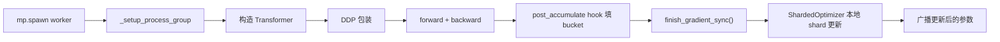

# 分布式训练与 Sharded Optimizer

`parallel/` 是仓库把 PyTorch 官方分布式封装拆开来讲的地方。代码不长，但它把“参数什么时候广播、梯度什么时候归约、参数什么时候重新同步”都写得非常直白。

## 分布式路径从哪里开始

顶层入口仍然是 `llm/training.py`。`train()` 总是通过：

```python
mp.spawn(
    _train,
    args=(args.world_size, args.backend, args),
    nprocs=args.world_size,
    join=True,
)
```

启动每个 worker。

每个 worker 进入 `_setup_process_group()` 后，会：

- 设置 `MASTER_ADDR=localhost`
- 设置 `MASTER_PORT=12390`
- 选择 `device = f"cuda:{rank % torch.cuda.device_count()}"`
- 调用 `dist.init_process_group(...)`

之后 `_train()` 做两件和分布式直接相关的选择：

- `mini_batch_size = args.batch_size // world_size`
- 如果 `world_size > 1`，用 `DDP` 包住模型，并把 `AdamW` 换成 `ShardedOptimizer`

所以单卡与多卡共用同一个训练循环，只是同步和状态拥有方式发生了变化。

## `parallel/ddp.py`：自定义梯度同步

这个 `DDP` 类很薄。`forward()` 只是调用底层模块。它存在的意义主要是定义：

- 初始化时参数如何同步
- backward 过程中梯度何时进入通信 bucket
- 训练循环何时才能安全地 step optimizer

### 初始化契约

构造函数里，wrapper 会遍历所有参数并执行：

```python
dist.broadcast(param.data, src=0)
```

因此 rank 0 是初始权重的真源。即便各个 rank 本地初始化不同，这个 broadcast 也会把它们统一。

对需要梯度的参数，代码还会注册：

```python
param.register_post_accumulate_grad_hook(
    lambda _, param=param: self._sync_gradients(param)
)
```

这个 hook 会在某个参数的梯度完成累积后立刻触发，因此通信可以从 backward 中途就开始，而不是等整次 backward 全结束。

### bucket 累积

`_sync_gradients()` 不会为每个梯度 tensor 单独发一个 collective。它会把梯度 append 到 `self.grads_bucket`，并同时按字节数累计：

```python
self.size += p.grad.numel() * p.grad.element_size()
```

当 bucket 超过阈值时，`_sync_grads_in_buckets()` 会：

1. 用 `torch._utils._flatten_dense_tensors` 把 bucket 展平成一个 tensor
2. 发起 `dist.all_reduce(..., async_op=True)`
3. 把异步 handle、flatten 后 tensor 和原梯度列表一起存下来
4. 清空 bucket

这和框架 DDP 的 bucket 思想一致：少量大 collective 比大量小 collective 更高效，异步 handle 则允许和后续 backward 计算重叠。

### backend 差异

文件对 backend 差异是显式处理的：

- NCCL 使用 `ReduceOp.AVG`
- GLOO 使用 `ReduceOp.SUM`，之后再自己除以 `world_size`

因此无论 backend 如何，最终梯度语义都保持为“平均梯度”。

### 显式完成点

训练循环必须在 `optimizer.step()` 之前调用：

```python
model.finish_gradient_sync()
```

`finish_gradient_sync()` 才是真正把“异步通信中”变成“梯度已可用于更新”的地方。它会：

1. flush 掉尚未满的 bucket
2. 等待所有异步 handle
3. 把 flatten 后结果 unflatten 回原始梯度 tensor

也就是说，在这个仓库里，“`backward()` 返回”与“梯度已经全局同步完成”不是同一件事。

## `parallel/sharded_optimizer.py`：优化器状态分片

DDP 解决的是训练吞吐，不解决 optimizer state 显存问题。对 Adam 类优化器来说，每个参数还要配一阶、二阶动量，这很快会成为显存大头。

`ShardedOptimizer` 的策略是：参数和梯度仍然复制，但优化器状态分片。

### 参数 owner 如何分配

`add_param_group()` 收到完整参数组后，会按当前位置取模筛出当前 rank 拥有的参数：

```python
for i, param in enumerate(full_params):
    if i % self.world_size == self.rank:
        sharded_params.append(param)
```

底层真正被构造出来的 optimizer，只会看到这部分参数。

因此 owner 规则完全由参数在 param group 内的顺序决定。

### `step()` 真正做了什么

`step()` 的执行分三段：

1. `_average_gradients()`
2. 只对本地拥有参数执行 `self.optimizer.step()`
3. 调用 `_synchronize_parameters()` 把更新后的 shard 广播回所有 rank

`_synchronize_parameters()` 重用了相同的 owner 规则：

```python
owner_rank = i % self.world_size
dist.broadcast(p.data, src=owner_rank)
```

所以虽然每个 rank 只本地更新一部分参数，但这一轮广播结束后，所有 rank 又重新拿到了完整且一致的模型。

### 什么被分片，什么没被分片

这个实现下：

- 参数是复制的
- 梯度是复制的
- 优化器状态是分片的

所以它属于 optimizer-state sharding，而不是更彻底的 ZeRO 风格全状态分片。

## DDP 与 ShardedOptimizer 如何配合

默认的多卡预训练路径里，这两层会同时工作：

1. `DDP.finish_gradient_sync()` 通过 bucket 异步 all-reduce 完成梯度平均
2. `ShardedOptimizer.step()` 在本地 shard 上执行更新
3. 更新后的参数 shard 再广播回所有 rank

值得注意的是：同步职责是拆在两个文件里的，而不是集中在一个大抽象里。`ShardedOptimizer` 本身也能平均梯度，但 `llm/training.py` 仍然要求自定义 DDP 在 step 前把同步彻底做完。

## 对 checkpoint 的影响

checkpoint 契约本身依然很简单：

- `save_checkpoint()` 保存 `model.state_dict()`
- `save_checkpoint()` 保存 `optimizer.state_dict()`

但在分布式运行时，这会带来几个现实后果：

- 如果直接保存 wrapper，本质上保存的是包裹后的模型 state
- `ShardedOptimizer.state_dict()` 只是代理本地 inner optimizer，因此不会自动把所有 rank 的 optimizer state 汇总起来

所以多卡路径更适合作为“通信和状态布局示例”来读，而单卡路径更适合作为通用 checkpoint 生产路径。

## 端到端控制流



## 这一层为什么值得读

这两份文件的价值不在于“比框架 DDP 更强大”，而在于把通常被隐藏的机制摊开了：

- 参数什么时候广播
- 梯度什么时候进入 bucket
- 异步 handle 怎么保存和等待
- 参数 owner 怎么确定
- 局部 step 之后如何重新变成完整同步模型

如果你已经知道 DDP 的教科书定义，这部分代码回答的是更实际的问题：到底是哪些 tensor 在什么时候跨卡移动。

## 当前实现的边界

这套设计目前保持得很克制：

- 没有梯度压缩
- 没有参数或梯度分片
- 没有多卡 optimizer checkpoint 汇总逻辑
- 没有专门的 checkpoint adapter 去 unwrap 自定义 DDP

这和仓库目标是一致的。代码足够小，所以你可以一路追到每个 collective 的真实调用点。
