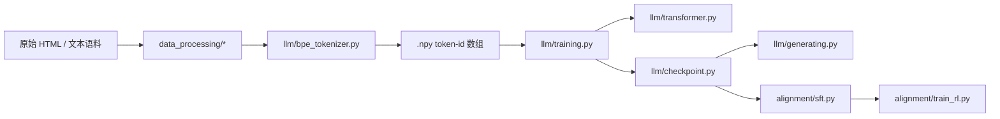

# 项目总览

这个仓库更适合被当成一整套训练栈来读，而不是只看某一个 `Transformer` 文件。代码边界基本分成五层：

- `llm/` 负责 tokenizer、模型、loss、优化器工具、预训练、checkpoint 和生成。
- `kernel/` 负责性能敏感的 attention kernel 与 benchmark。
- `parallel/` 负责多卡通信与优化器状态分片。
- `data_processing/` 负责分词前的语料清洗。
- `alignment/` 负责基于数学任务的 SFT 与 RLFT。

后面的章节会按这些边界逐层展开。

## 端到端路径

仓库里最主要的一条执行链是：

1. 原始文本先经过 `data_processing/` 清洗。
2. `llm/bpe_tokenizer.py` 训练 byte-level BPE，并把文本编码成 token id。
3. `llm/training.py` 对 `.npy` token 数组做 mmap，切固定窗口，训练 `Transformer`。
4. `llm/checkpoint.py` 保存模型与优化器状态。
5. `llm/generating.py` 重新加载模型和 tokenizer，做 top-p 采样。
6. `alignment/sft.py` 与 `alignment/train_rl.py` 在外部 base model checkpoint 上做下游对齐。

这里有一个很重要的风格切换：

- 预训练部分尽量从零实现，强调机制透明
- 对齐部分直接使用 Hugging Face、accelerate、vLLM，强调现实工作流

## 核心层：`llm/`

`llm/` 是仓库最密集的一层，既包含基础模块，也包含消费这些模块的训练脚本。

### `llm/bpe_tokenizer.py`

这个文件覆盖了完整的 BPE 生命周期：

- 基于正则的预切分
- special token 保留
- byte 词表初始化
- merge 统计与学习
- 编码时的贪心 merge 回放
- 解码时的 byte 重组
- tokenizer 持久化

实现里最关键的选择是：词表条目使用 `bytes`，不是字符串。这让训练和推理都建立在 byte 级边界上，而不是依赖 Unicode 字符级假设。

### `llm/transformer.py`

这个文件不只是一个 `Transformer` 类，而是把模型和常用训练工具一起放在一处：

- `Linear`
- `Embedding`
- `RmsNorm`
- `Softmax`
- `ScaledDotProductAttention`
- `MultiHeadAttention`
- `MultiHeadAttentionWithRoPE`
- `RoPE`
- `SwiGlu`
- `TransformerBlock`
- `Transformer`
- `CrossEntropyLoss`
- 自定义 `SGDDecay`
- 自定义 `AdamW`
- cosine 学习率调度
- 梯度裁剪

因此 `llm/training.py` 才能保持很小，因为大部分模型本地逻辑都已经封装在这里。

### `llm/training.py`

这个文件负责整个训练生命周期，而不只是 minibatch 循环：

- 按 rank 设置随机种子
- 初始化分布式进程组
- mmap 读取 token 数组
- 采样自回归窗口
- 构造模型
- 多卡时接入 `DDP` 和 `ShardedOptimizer`
- rank 0 上做验证
- 梯度裁剪
- 应用 cosine 学习率
- 定期保存 checkpoint

训练脚本刻意保持直接，这样你能把每个高层训练概念映射回 1 到 2 个具体函数。

### `llm/checkpoint.py` 与 `llm/generating.py`

checkpoint 的契约很小，但很关键。保存对象只有三项：

- `model`
- `optimizer`
- `iteration`

`llm/generating.py` 通过重新构造相同的 `Transformer`、重新加载 tokenizer、再做 temperature + top-p 采样，证明这份 checkpoint 足够支撑推理。

## 性能层：`kernel/` 与 `parallel/`

仓库把模型定义与性能/规模问题分开了。

### `kernel/`

`kernel/flash_attention_triton.py` 提供了 Triton 版 Flash Attention。它通过分块维护 softmax 统计量，避免显式构造完整的 attention score 矩阵，从而降低显存压力。

`kernel/flash_attention_mock.py` 则是更慢但更易读的参考实现。`bench_mark/` 下的脚本再负责验证这个优化值不值得引入。

所以 `kernel/` 的关注点是：

- 算法
- 实现
- 正确性对照
- 性能测量

而不是“塞进一个看不懂的高性能 primitive”。

### `parallel/`

`parallel/ddp.py` 自己实现了：

- 初始化时参数广播
- `post_accumulate` 梯度 hook
- 梯度 bucket 化
- 异步 `all_reduce`
- 在 `finish_gradient_sync()` 中显式等待与回填

`parallel/sharded_optimizer.py` 则通过简单的取模规则，把优化器状态按参数 owner rank 分片，并在本地 step 后把更新过的参数 shard 广播回所有 rank。

这两份代码一起解释了：同一个训练循环怎样从单卡扩展到多卡，而不把细节完全交给框架黑箱。

## 数据层：`data_processing/`

数据处理代码存在的前提很简单：原始文本默认是不干净的。模块边界如下：

- `html_process.py`：HTML 到纯文本
- `language_identification.py`：基于 FastText 的语言过滤
- `quality_filter.py`：低成本启发式过滤
- `deduplicate.py`：精确去重与近似去重
- `mask_pii.py`：基于正则的脱敏
- `harmful_detect.py`：NSFW 与 toxic 分类
- `quality_classfier.py`：学习式质量打分

这里最值得注意的是顺序：越便宜、越确定的过滤越靠前，越重的语义判断越靠后。这样大规模预处理才有现实可行性。

## 对齐层：`alignment/`

对齐代码故意换了一种风格：它不再坚持“从零实现一切”，而是直接采用当前主流大模型适配工作流。

### `alignment/sft.py`

SFT 路径会：

- 加载 Hugging Face causal LM
- 用 `gsm8k` 构造带 `<think>` / `<answer>` 结构的样本
- 对 prompt token 做 label masking
- 使用梯度累积
- 通过独立 vLLM 实例评估

这是仓库里的 completion-only 微调示例。

### `alignment/train_rl.py`

RL 路径进一步加入：

- 基于 vLLM 的 rollout 生成
- 冻结 reference model
- group 内奖励归一化
- clipped policy gradient 目标
- 多 GPU 角色拆分
- 周期性评估

所以这个仓库不只适合看模型本体，也适合看现代 post-training 的系统结构。

## 按依赖关系的推荐阅读顺序

如果你想高效理解实现细节，推荐按这个顺序读：

1. `Tokenizer 与词表`
2. `Transformer 核心`
3. `训练循环与 Checkpoint`
4. `Flash Attention 与 Kernel 优化`
5. `分布式训练与 Sharded Optimizer`
6. `数据处理流水线`
7. `gsm8k 上的监督微调`
8. `gsm8k 上的强化学习微调`

这个顺序贴近真实依赖关系：tokenization 先于预训练，预训练先于 checkpoint 与推理，性能层扩展同一个模型，对齐流程则建立在已可用的模型之上。

## 这个仓库真正优化的是什么

这个仓库主要优化的不是生产级封装，而是可读性：

- 每个核心概念都有单独文件
- 训练流程用显式函数而不是深层 callback 栈
- kernel 与分布式和基础模型逻辑分离
- 对齐流程足够具体，可以复现

因此文档也按模块边界组织，而不是按营销式功能分类。理解这个项目的最快方式，是沿着张量、checkpoint 和采样输出在这些边界之间的流动去读。
