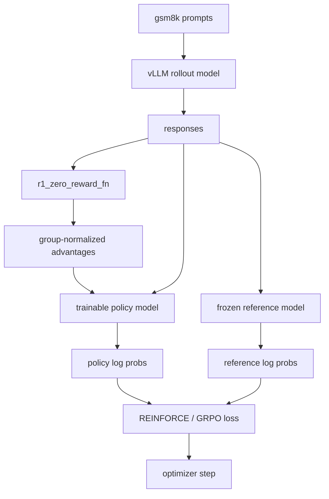

# gsm8k 上的强化学习微调

RLFT 路径沿用了同一个 GSM8K 任务，也沿用了同一套 `<think> / <answer>` 输出契约，但把监督式 next-token 训练换成了策略梯度更新。这里重点讲当前代码的真实实现：多角色模型放置、group 奖励归一化、response-only masking，以及 `alignment/grpo.py` 里究竟实现了哪些 loss 变体。

## 文件级职责

RL 工作流被拆成几份文件：

- `alignment/train_rl.py`：主调度与训练循环
- `alignment/grpo.py`：奖励归一化与策略梯度 loss
- `alignment/drgrpo_grader.py`：格式与数学答案 reward
- `alignment/evaluate.py`：批量评估
- `alignment/args.py`：CLI 默认参数

数据集与 prompt 模板沿用 SFT 路径，所以 RL 与 SFT 在任务定义和输出结构上完全一致。

## 入口与初始 checkpoint

`train_rl.py` 的 `__main__` 会同时解析 RL 参数和 SFT 参数。

这不是偶然的，因为当 RL checkpoint 不存在时，脚本会使用：

```python
sft_args.checkpoint_path
```

作为 base policy checkpoint。

入口控制逻辑是：

- 如果 `args.checkpoint_path` 已经包含权重文件，就跳过训练，直接评估 RL checkpoint
- 否则，从 SFT checkpoint 开始做 RL 训练

所以这套 RLFT 代码本质上是建立在 SFT 之后的 post-training 阶段，而不是直接从原始 Hugging Face base model 起步。

## 多角色设备拓扑

`train_rl.py` 把不同职责拆到不同设备上：

- `sample_model`：vLLM rollout 生成
- `reference_model`：冻结的 log-prob 参考模型
- `eval_model`：周期性评估
- `model`：可训练 policy

CLI 默认值是：

- `sample_device = cuda:7`
- `reference_model_device = cuda:6`
- `eval_device = cuda:5`

剩下的 GPU 再交给 `partition_model_across_devices(args)` 去承载可训练 policy。

### `partition_model_across_devices()` 的工作方式

这个函数会：

1. 读取总 GPU 数
2. 从中移除 sampling、reference、evaluation 所占的卡
3. 取剩余第一张卡作为 `main_gpu`
4. 把 `model.embed_tokens`、`lm_head`、`model.norm` 放到 `main_gpu`
5. 把 transformer layer 均匀摊到其余 policy GPU 上

layer 分配规则是：

```python
layers_per_gpu = math.ceil(num_layers / len(layer_gpus))
```

然后按层号顺序依次分配。

因此当前实现默认面向一台 GPU 数足够多的本地机器，能同时容纳 rollout、reference、eval 与 training 四种角色。

## 初始化路径

在 `train(args, base_model_checkpoint_path)` 里，主要运行时对象按这个顺序构造：

1. `SummaryWriter`
2. 从 `base_model_checkpoint_path` 初始化的 vLLM `sample_model`
3. 从 `args.model` 初始化 tokenizer
4. 从 `base_model_checkpoint_path` 初始化的可训练 Hugging Face policy model
5. 从 `base_model_checkpoint_path` 初始化的冻结 `reference_model`
6. `Gsm8kDataset` 与 `DataLoader`
7. `torch.optim.AdamW`

所以 rollout engine、reference model 与 trainable policy 一开始都来自同一个 checkpoint。

## 每步数据流

`DataLoader` 每次给出：

- `prompts`
- 监督 completion，这里在 RL 模式下不会使用
- `ground_truths`

代码会把每个 prompt 重复 `group_size` 次：

```python
grouped_prompts = [p for p in prompts for _ in range(group_size)]
grouped_ground_truths = [gt for gt in ground_truths for _ in range(group_size)]
```

如果 `loss_type == "no_baseline"`，代码会强制把 `group_size` 设成 `1`；否则就使用配置里的 group size。

## rollout 生成

rollout 由 vLLM 负责，采样参数包括：

- `temperature = args.sampling_temperature`
- `top_p = args.sampling_top_p`
- `min_tokens = args.sampling_min_tokens`
- `max_tokens = args.sampling_max_tokens`
- `stop = ["</answer>"]`
- `repetition_penalty = 1.1`
- `include_stop_str_in_output = True`

拿到 response text 后，脚本会把它和 prompt 拼回成 `full_texts`。

因此后续 policy-gradient 部分其实是在“完整 prompt + response token 序列”上工作，只是稍后再把 prompt 区域 mask 掉。

## reward 计算与 group normalization

reward function 仍然是 `r1_zero_reward_fn`，所以 RL 和 SFT 共享完全相同的成功定义：

- 格式合法
- 最终答案正确

`alignment/grpo.py` 中的 `compute_group_normalized_rewards()` 则把原始 reward 变成 advantage。

它的执行逻辑是：

1. 逐条 rollout 计算标量 raw reward
2. reshape 成 `[n_prompts, group_size]`
3. 减去组内均值
4. 可选地再除以组内标准差
5. 最后 flatten 回一维

所以 baseline 不是全局 batch 级的，而是“同一个 prompt 采样出的多条 response”这一小组内部的局部 baseline。

## tokenization 与 response mask

脚本会分别 tokenizer：

- grouped prompt
- 完整的 prompt + response

prompt 长度来自 prompt attention mask，而不是字符长度。对每个 microbatch，response mask 的构造方式是：

```python
start = mb_prompt_lengths[j].item()
end_pos = mb_attention_mask[j].sum().item()
response_mask[j, start:end_pos] = True
```

随后再把这些位置中的：

- padding token
- `eos_token_id`
- `bos_token_id`

排除掉。

因此 loss 平均只覆盖 policy 真正生成出来的 response token。

## log probability 的计算

对每个 microbatch，trainable policy 会计算：

```python
policy_logits = model(...).logits
policy_log_probs = gather(log_softmax(policy_logits), input_ids)
```

冻结 reference model 会计算：

```python
old_logits = reference_model(...).logits
old_log_probs = gather(log_softmax(old_logits), input_ids).detach()
```

reference forward 在自己的设备上、`torch.inference_mode()` 下执行，然后把 logits 挪回 policy device。

## `alignment/grpo.py` 里的三种 loss

`compute_policy_gradient_loss()` 一共暴露三种模式。

### `no_baseline`

直接用 raw reward：

```python
- reward * log_prob
```

这就是最基础的 REINFORCE 形式。

### `reinforce_with_baseline`

把 raw reward 换成 group-normalized advantage：

```python
- advantage * log_prob
```

它通过减去组均值来降低方差。

### `grpo_clip`

这是带裁剪的 importance-ratio 目标：

1. 计算 `log_ratio = policy_log_probs - old_log_probs`
2. 指数化得到 importance ratio
3. 把 ratio clamp 到 `[1 - cliprange, 1 + cliprange]`
4. 分别乘 advantage，得到 unclipped 和 clipped 两项
5. 取负的 `min(...)`

这是仓库里最接近 PPO 风格的目标，但实现仍然保持 token 级、可直接阅读。

## microbatch backward 与梯度累积

`grpo_microbatch_train_step()` 不只是计算 loss，它内部会直接调用 `mean_loss.backward()`。

在 backward 之前，它会：

- 从所选 loss 计算 per-token loss
- 用 `masked_mean(...)` 在 response token 上做平均
- 如果需要，再除以 `gradient_accumulation_steps`

`train_rl.py` 通过：

```python
grad_acc_steps = math.ceil(total_samples / args.train_mini_batch_size)
```

决定这次 rollout batch 要分成多少个 microbatch。

所有 microbatch 跑完之后，脚本才会：

- `clip_grad_norm_(..., max_norm=1.0)`
- `optimizer.step()`
- `optimizer.zero_grad()`

## 周期性评估

每到 `evaluate_freq`，脚本会：

1. 把当前 policy 保存到 `args.tmp_checkpoint_path`
2. 同时保存 tokenizer
3. 临时启动一个新的 vLLM `LLM(...)` 做评估
4. 运行 `evaluate_math(...)`
5. 把 `score["avg_all_rewards"]` 写到 TensorBoard
6. 释放临时评估模型

每轮 dataloader 结束后，它还会把 policy 保存到最终 `args.checkpoint_path`。

## 端到端角色拆分



## 当前实现边界

有几件事如果不看代码很容易误解。

### rollout sampling 目前不会热更新

`sample_model` 只在训练开始时从 `base_model_checkpoint_path` 初始化一次，之后训练循环里并不会把最新 policy 权重再同步给 rollout engine。

也就是说，当前 rollout 始终来自起始 checkpoint，除非后续扩展代码。

### reference model 也是固定的

`reference_model` 也只在开始时从起始 checkpoint 初始化一次。代码里虽然留了“周期性更新 old policy”的注释块，但它目前是注释掉的。

因此当前 `grpo_clip` 比较的是“当前 policy 与固定参考策略”，而不是与一个不断刷新的 old policy。

### 一些 CLI 参数已经为后续扩展留好口子

脚本已经暴露了多种 loss type、group 配置和临时 checkpoint 路径，但整体控制流仍然刻意保持在一个文件可读完的复杂度内。

## 为什么这一章重要

这是仓库里最能体现 post-training 系统设计的一层：

- 任务特定 reward 设计
- grouped sampling 与方差降低
- token 级 response-only masking
- 多角色 GPU 放置
- 用同一套 reward 契约做周期性离线评估

它不是一套完整 RLHF 框架，而是一份足够紧凑、但能把 policy、rollout engine、reference model 和 evaluator 如何协作讲清楚的实现。
