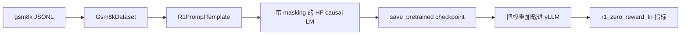

# gsm8k 上的监督微调

SFT 路径是仓库里风格切换最明显的一部分。`llm/` 里的预训练强调从零实现；`alignment/` 里的后训练则直接采用现实中常见的大模型工具链：Hugging Face 负责可训练模型，`accelerate` 负责多卡 device map，vLLM 负责高效评估。

## 文件级职责

SFT 这一条链路分散在几份小文件里：

- `alignment/dataset.py`：把 GSM8K JSONL 变成 prompt / completion 样本
- `alignment/r1_prompt.py`：定义 prompt 与 response 的格式契约
- `alignment/sft.py`：负责训练、checkpoint 和 epoch 末评估
- `alignment/evaluate.py`：负责批量生成与指标汇总
- `alignment/drgrpo_grader.py`：负责格式检查与数学答案判分
- `alignment/util.py`：负责 device map 和 vLLM 初始化
- `alignment/args.py`：负责 CLI 默认参数

这样的拆分让 `sft.py` 本身保持简洁：数据契约、训练循环、评估逻辑各自归属明确。

## 数据集构造

`Gsm8kDataset` 会读取 `data/gsm8k/*.jsonl`，对每条记录做：

1. 读取 `question`
2. 读取 `answer`
3. 按 `####` 切开
4. 前半段作为 reasoning text
5. 后半段作为最终答案

它内部维护三组并行数组：

- `self.data`：prompt 字符串
- `self.label`：监督 response 字符串
- `self.ground_truth`：最终答案

prompt / response 的具体格式由 `R1PromptTemplate` 决定。

## Prompt 与 Response 契约

`R1PromptTemplate` 会从磁盘读取模板文件，并提供三个 helper：

- `gen_prompt(question)`
- `gen_response(think, answer)`
- `gen_all_corpus(question, think, answer)`

最重要的是 `gen_response()`：

```python
return think + "</think>" + " <answer>" + answer + " </answer>"
```

也就是说，监督目标并不是从空白开始写，而是默认 prompt 模板已经以 `Assistant: <think>` 结束，completion 负责把思维过程收尾，再输出结构化答案块。

这个格式契约不是装饰。后面的 grader 会严格要求响应里出现：

- `</think> <answer>`
- `</answer>`

## 默认配置

`get_sft_parser()` 定义了默认运行形态：

- model：`Qwen/Qwen2.5-Math-1.5B`
- dtype：`float32`
- `max_seq_len`：`1024`
- 物理 `batch_size`：`1`
- `gradient_accumulation_steps`：`8`
- 训练设备：`cuda:0` 到 `cuda:6`
- 评估设备：`cuda:7`
- checkpoint 路径：`checkpoints/math_sft`

因此默认脚本假设本地有一台多 GPU 机器，并且专门留出一张卡给 vLLM 做评估。

## 模型放置与 vLLM 初始化

`alignment/util.py` 负责设备相关逻辑。

### 可训练 HF 模型

`get_device_map()` 会：

1. 先加载 model config
2. 在 `init_empty_weights()` 下构造空模型
3. 执行 `tie_weights()`
4. 调用 `infer_auto_device_map(...)`

`sft.py` 随后用这个 device map 去加载真实模型：

```python
AutoModelForCausalLM.from_pretrained(
    model_id,
    device_map=device_map,
    trust_remote_code=True,
)
```

### 评估模型

评估模型是一个独立的 vLLM 实例，由 `init_vllm(...)` 创建。这个 helper 会先 monkey-patch：

- `torch.distributed.get_world_size`，强制返回 `1`
- vLLM 内部一个 memory footprint 断言

然后再构造 `LLM(...)`。

这个实现细节很重要，因为它使得 vLLM 能和多卡 Hugging Face 训练模型共存在同一流程里。

## completion-only loss 的构造

`sft.py` 的核心实现细节是 label masking。

每个 batch 内，脚本会：

1. 取出 `prompts` 与 `completions`
2. 拼成 `prompt + completion + eos`
3. 对完整文本做 tokenizer，带 padding 与 truncation
4. 再单独对 prompt 做 tokenizer，且 `add_special_tokens=False`
5. 得到每个样本的 prompt token 长度
6. 复制 `inputs.input_ids` 到 `labels`
7. 把 prompt 区间对应的 label 设成 `-100`
8. 把 padding token 对应的 label 也设成 `-100`

关键代码是：

```python
for idx in range(len(prompts)):
    prompt_len = prompt_lengths[idx]
    labels[idx, :prompt_len] = -100

labels[labels == tokenizer.pad_token_id] = -100
```

这意味着模型只在 completion 区间上被优化，不会被要求重复预测 prompt 前缀。

## 训练循环

训练循环本身非常短：

1. 构造 batch
2. 通过 Hugging Face 模型计算 masked causal-LM loss
3. 用 `gradient_accumulation_steps` 对 loss 做归一化
4. `loss.backward()`
5. 每到累积边界才 `optimizer.step()`
6. step 后 `optimizer.zero_grad()`

优化器使用的是标准 `torch.optim.AdamW`，配置来自 CLI：

- `lr`
- `beta1`
- `beta2`
- `weight_decay`

这份脚本里没有再叠加自定义 scheduler、grad scaler 或 sequence packing。真正重要的是数据契约和 completion-only loss。

## 每个 epoch 结束后的评估

每个 epoch 结束后，`sft.py` 会通过 `load_policy_into_vllm_instance()` 把更新后的 policy 权重塞进当前运行着的 vLLM 实例。

这个 helper 会直接钻进 vLLM engine 内部：

```python
llm_model = llm.llm_engine.model_executor.driver_worker.model_runner.model
llm_model.load_weights(state_dict.items())
```

因此评估不会每轮都重启一遍完整推理引擎。

随后 `evaluate_math()` 会：

1. 读取 GSM8K 测试集
2. 用同一份 `R1PromptTemplate` 重建 prompt
3. 让 vLLM 生成输出
4. 用 `r1_zero_reward_fn` 对每条输出打分
5. 聚合三项指标：
   - `avg_format_rewards`
   - `avg_answer_rewards`
   - `avg_all_rewards`

默认评估采样参数很简单：

- `temperature=1.0`
- `top_p=1.0`
- `max_tokens=1024`

## reward function 与指标

`r1_zero_reward_fn()` 才是真正的评估契约。

它先检查格式：

- 是否包含 `</think> <answer>`
- 是否包含 `</answer>`

如果格式不合法，所有 reward 都是 0。

如果格式合法，grader 会：

1. 抽取 answer span
2. 如有 `\boxed{...}`，先解包
3. 调用 `grade(...)`，做字符串规范化、符号解析与数学等价判断

返回字典为：

```python
{
    "format_reward": ...,
    "answer_reward": ...,
    "reward": ...,
}
```

这说明 SFT 不只是看训练 loss，而是已经在用 RLFT 后续也会复用的下游目标来衡量模型行为。

## Checkpoint 与入口行为

每轮评估后，脚本会保存：

- `model.save_pretrained(args.checkpoint_path)`
- `tokenizer.save_pretrained(args.checkpoint_path)`

`__main__` 还负责一个简单控制逻辑：

- 如果 checkpoint 目录已经存在且非空，就直接加载它进 vLLM 并评估
- 否则先训练，再评估

所以同一个文件同时承担 trainer 和“评估现有 SFT checkpoint”的入口职责。

## 端到端流程



## 现实含义

当前 SFT 实现有几个很明确的选择：

- prompt 格式与 RLFT 共用同一套结构契约
- loss 边界是在 token 空间里算的，而不是字符空间
- 训练模型与评估模型分离，因此不会复用训练图
- 保存的是完整 Hugging Face checkpoint，而不是自定义轻量格式

这让这份脚本成为一个很好的桥梁：一边保留了可讲清楚的训练细节，一边又直接落在当前大模型后训练的主流生态里。
